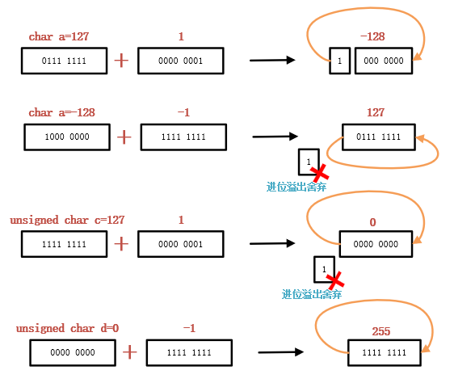
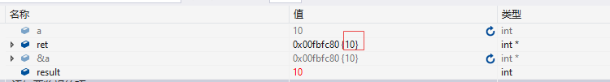
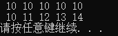
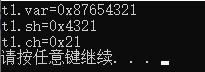
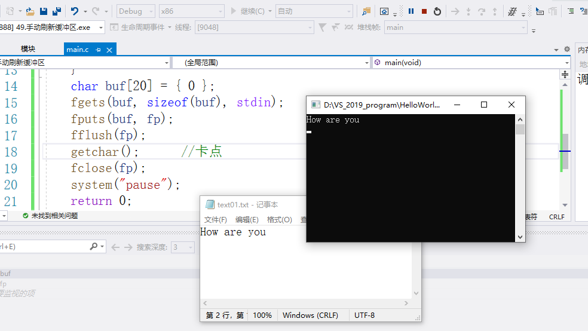

## Welcome to GitHub Pages

You can use the [editor on GitHub](https://github.com/DennisCheng-520/C_BasicCourse.github.io/edit/master/README.md) to maintain and preview the content for your website in Markdown files.

Whenever you commit to this repository, GitHub Pages will run [Jekyll](https://jekyllrb.com/) to rebuild the pages in your site, from the content in your Markdown files.

### Markdown

Markdown is a lightweight and easy-to-use syntax for styling your writing. It includes conventions for

# Day02-4.26-AM


## 内部设备

- CPU不能和磁盘直接交换数据
- CPU主要组成：运算器（算逻单元）、预取器、控制器、寄存器
- 内存储器
  - ROM	只读存储器（Read Only Memory）
  - RAM    随机存储器（Random Access Memory）

- 内存依靠“电信号”来存储用户数据，断点清空，数据不能长久存储
  - 优点：读写速度快，和磁盘恰好相反

## 外部设备

- 分为输入设备、输出设备、外存储器
- 机械硬盘：磁盘读写是一个物理操作，靠“磁信号”存储数据，数据读写速度慢，但能长久存储
- 固态硬盘：用电子存储芯片阵列制成的硬盘，不存在机械动作，但依旧比内部存储器慢得多

## CPU-内存-硬盘间的关系


- 3+5通过预取器读取，控制器对提取的数据在算逻单元处理，处理结果放到寄存器堆中。
- 高速缓冲存储器是为了解决CPU与内存储器之间速度不匹配的问题
- 内存、cache缓存用于存储程序运行过程中需要保存的临时数据
- CPU从内存中读取数据

## 软件系统

### 系统软件

- 操作系统是管理计算机硬件与软件资源的计算机程序
- 操作系统**向下提供**：驱动程序、管理计算机硬件
- 操作系统**向上提供**：
  - 图形界面：普通用户、鼠标
  - 终端界面：开发人员、普通用户
  - 系统调用：开发人员专用，在此基础上开发应用
- 常见OS：Windows、MacOS、Linux、Unix，其中前三个都是在Unix的基础上开发的。
- 语言处理系统：
  - 计算机语言：C、C++、Java、Python
  - 机器语言：只能识别二进制序列

### 应用软件

* 常见APP，有特定应用功能
* 建立在操作系统之上，由OS提供服务

## 编译器和语言

### 编译器

- CPU只认识二进制序列
- 将高级语言变成计算机可识别的语言
- 语言不通，语法不同，翻译也不同——编译器不同

## C语言概述

### 计算机语言发展史

1. （第一代）机器语言：二进制序列
2. （第二代）汇编语言：有助记符，只针对某一特定硬件编程，跨平台能力差
3. （第三代）C语言
4. （第四代）C++、Java、Python，提升程序扩展性
5. （第五代）SQL：人类更容易理解

语言的发展只会向着人类可读。易懂的方向发展，计算机的识别性能更低；越是靠近计算机底层的语言，计算机的识别性能更高，执行效率更快。**所以C/C++运行速度很快。*

### C标准简史

共有三个时间刻度和标准：1989的C89标准、1999的C99标准、2011的C11标准

### C标准的影响

- C语言的标准理解为C语言说明书，并没有强制性约束力
- 编写程序之前要确定编译器的版本
- 常见C/C++编译器
  1. Borland C++ 宝蓝公司
  2. Intel C++ 英特尔编译器
  3. VC++ 编译器，运行在VS中的编译器，封装在cl.exe中
  4. g++编译器（gcc是编译套件），是Linux默认使用的编译器，对C标准最好。其中g++编译器在C++中用得到，gcc编译器是C语言中用的

## C语言特点

- **优点**
  - 学习成本低
  - **执行速度快**，<u>因为靠近计算机底层</u>
  - **功能强大**，<u>大多数高级语言都是基于C开发的</u>
  - 编程自由

- **缺点**
  - 写代码实现周期长
    - C语言需要做好每一块砖才能砌墙，而Java直接调用接口就砌成墙
    - 由于每个功能都是自己用C编写的，所以对底层代码实现更为了解
  - 过于自由，经验不足易出错，对程序员的经验要求较高
  - 对平台库依赖较多

## C语言的应用领域

1. 服务器开发
2. 操作系统开发（操作内存需要用指针，其他语言都没有）
3. 上层应用开发
   - MFC；90年代的老伴软件，但军工、银行、运营商还在使用
   - Qt：跨平台（支持Windows、Linux、MacOS）。完成开发就不需要做移植了。界面美观，时尚。
4. 嵌入式开发
5. 人工智能、硬件驱动
6. 中间件（介于驱动程序和应用程序之间的软件）：大多数的函数库是用C编写的
7. 网络攻防、网络安全（基本是C/C++）

# Day02-4.26-PM

## 面向过程和面向对象简单说明

- 面向过程是人类正常的一般思路和步骤，而面向对象是一种反人类的思想，每个对象都抽离出来，建立好，再思考每个对象之间的关系。

## 32个关键字（重点掌握）


- const 只读，修饰某个变量为只读
- struct在C++中不使用，替换成用类实现
- typedef通常用来进行别名修改
- void表示空，修饰函数时无返回值

## HelloWorld释义及运行

### 方式一（在gcc编译环境下编译）

- 新建一个txt文件，在里面编写代码后，改后缀名为.c
- 在该文件的上方路径栏中输入cmd，然后回车


- 在控制台中输入dir，可以查看当前文件路径下所有文件信息
- 再输入如下代码，可以对HelloWorld.c进行编译

```c
gcc HelloWorld.c -o HelloWorld.exe
```

- 生成.exe文件后，再输入如下代码，执行这个可执行文件

```c
HelloWorld.exe
```


### 方式二（在VS 2019中编写）

- **IDE**：是指包含编辑、编译、调试、输出等功能的集成开发环境
- 常用IDE
  - Windows：
    - VS系列开发工具
    - Clion：跨平台的IDE
    - Dev C++：只支持Windows
    - Qt Create：跨平台的IDE
    - Eclipse：对应平台有对应的版本

- MacOS：
  - Xcode
  - Clion
  - Qt Creator
  - Eclipse
- Linux：
  - vi/vim --- 文件编辑器。
  - Clion
  - Qt Creator
  - Eclipse
- VS 2019基本使用
  - .c和.cpp在VS 2019运行的特性有区别
  - 项目名尽量少用中文

### 代码解释

```c
#include <stdio.h>  
// #:表示引入外部文件。 
// include:指定包含文件名  
// <>:表示系统直接按系统指定的目录检索；如果是“ ”，则表示系统先在 "" 指定的路径查找头文件(没写路径代表当前路径)，如果找不到，再按系统指定的目录检索
// stdio.h: 头文件，标准输入输出文件
// 整个 #include <stdio.h> 为下面用到该文件的函数服务

int main(void)	// int表示 main 函数返回整数值。对应下面的 return 后面的值。
// main：代码程序的入口，整个项目只有一个main()函数
// (void)：表示该函数无形参，即为空。无形参时必须写上，这是规范写法
{  // 函数体
	printf("hello world\n");  
	return 0;	// 函数类型不是void的，需要return返回相应的类型值
} //函数体终止。
```

### 注释

- 单行注释 //
- 多行注释 /*      */
  - 重要特性：不允许多行注释之间嵌套使用，允许单行嵌套
- 条件编译（算作多行注释）

```c
#if 0
	abcdefg
    defgh
#endif
```

## 解决VS运行程序后，终端一闪而过问题

1. 方法1：通过 system() 函数解决。在 程序的 return 0；之前，添加如下函数。

   ```c
   system("pause");
   ```

   需要在起始位置添加 头文件 #include <stdlib.h>

2. 方法2：通过修改 VS 中项目的配置属性解决。

   - 项目名称上右键 —— 属性
   - 
   - 再次创建新项目，依然需要重新设置。


## VS代码运行的4种代码编译模式

1. Debug x86：调试模式，运行32位程序。 —— 学习期间**默认使用模式**。
2. Debug x64：调试模式，运行64位程序。 —— 调试模式生成的 exe文件较大。带有调试表。
3. Release x86：发布模式，运行32位程序。 
4. Release x64：发布模式，运行64位程序。—— 生成的 exe 文件较小。没有调试表。

## system函数

- 使用的头文件为 #include <stdlib.h>

- 作用：执行系统命令。

  ```c
  #include <stdio.h>
  #include <stdlib.h>		//服务于system函数
  #include <Windows.h>	// 服务于Sleep函数
  
  int main(void)
  {
  	printf("HelloWorld\n");
  	// system("pause");		// 暂停
  	// system("cmd");		// 唤起一个终端
  	// system("calc");		// 启动计算器
  	// system("mspaint");	// 打开系统自带画图工具
  	// system("notepad");	// 打开记事本
  
  	Sleep(2000); // 睡眠2000毫秒，需要使用头文件#include<Windows.h>
  	system("cls");		// 清空当前屏幕。
  	return 0;
  }
  ```

# Day03-4.27-AM

##  return语句

- return代表函数执行完毕，返回return代表函数的终止
- 如果main定义的时候前面是int，那么return后面就需要写一个整数；**如果main定义的时候前面是void，那么return后面什么也不需要写**
- 在main函数中return 0代表程序执行成功，return -1代表程序执行失败
- int main( )和void main( )在C语言中是一样的，**<font color=red>但C++只接受int main这种定义方式</font>**

## main函数正规写法

- **写法一**(无形参)：

```c
int main(void)
{
    return 0;
}
```

- **写法二**（有形参）：

```c
int main(int num,char *p[])
{
    return 0;
}
```

## gcc编译4步骤（从.c到生成.exe）

- gcc是一个编译工具集合，包含预处理文件、编译器、汇编器、链接器。


- 在同一目录下逐个生成过程文件和可执行文件


- 在控制台窗口操作：


### 预处理

- 预处理阶段会将头文件展开
  - 
  - 在hello.i可以看到头文件只参与预处理过程
  - 
- 使用的命令格式

```c
gcc -E xxx.c -o xxx.i
```

- 其中的参数：
  - -E		用来生成预处理文件参数
  - -o        用来指定生成的文件名
- 作用
  1. 在头文件展开阶段不检查语法错误
     - 比如#include<stdio.h>去掉，换成#include"text.txt"，不会报错
  2. 宏定义替换（将宏定义用宏值替换）
     - 宏定义格式：	#define 宏名  宏值
     - eg：#include  N  10
  3. 替换注释（将注释替换成空行或者空格）

### 编译

- 使用的命令格式

```c
gcc -S xxx.i -o xxx.s
```

- 其中的参数：
  - -S        用来生成编译文件参数
  - -o        用来指定生成的文件名
- 作用
  1. <font color=blue>逐行检查语法错误，但不会检查函数名问题</font>
     - 比如main函数改成mian函数不会报错
  2. 将无错误的预处理文件转换成为汇编文件（内部都是汇编命令）

### 汇编

- 在gcc编译器中生成的目标文件是.o，而在VS中的编译器生成的目标文件是.obj
- 使用的命令格式

```c
gcc -c xxx.s -o xxx.o
```

- 其中的参数：
  - -c         用来生成汇编文件参数
  - -o        用来指定生成的文件名
- 作用
  - 翻译，将汇编指令的.s文件翻译成二进制文件

### 链接

- 使用的命令格式

```c
gcc xxx.o -o xxx.exe
```

- 作用
  1. 库引入
  2. 合并多个目标文件
     - 
  3. 合并启动例程——启动例程：负责加载调用main函数
     - 
- **gcc编译4步骤之间可以跳步执行，不能逆向执行**。

# Day03-4.27-PM

## 程序调试

- 调试的前提是程序无语法错误
- 调试的核心：让程序一行行向下执行
- **快捷功能**
  - 逐语句F10		不进入函数内部，逐行向下执行
  - 逐过程F11        用于进入函数内部
  - 逐断点Shift+F11（跳出）或点击"继续"         逐个断点走
- 必须在Debug模式下可以启动调试，Release模式下不行

## 变量

- 使用变量前需要定义该变量，即向内存申请该变量的空间

- 变量名是对所申请空间的别名标记，相当于酒店里的房间号

- 变量声明是让编译器知道将在内存中开辟指定大小的空间，但没有开辟，只是说一下

- 变量声明和定义的区别：

  1. 声明不开辟内存空间，定义开辟内存空间
  2. 定义变量的同时也申明了该变量，但声明不是定义

  ```c
  int a;	//声明变量
  int b=10;	//定义变量（即有初始化）
  ```

## 常量定义

```c
#define N 10		//末尾无分号
const r=5;			//少用，虽然修改为只读，但是可以通过指针来修改
```

- flaot类型默认只显示小数点后6位；%.2f	格式匹配符，只显示小数点后两位，对第三位四色五入

## 标识符

1. 必须以字母或下划线开头，其后可以是字符、下划线、数字
2. 标识符区分大小写字母
3. C语言中的关键字不能作为标识符
4. 建议（使用大写字符命名常量；小写和‘_’命名变量）
   1. 大驼峰法
   2. 小驼峰法
   3. 小写+下划线（C语言常用）

## sizeof关键字

- 获取括号内数据类型大小，单位是字节。**<font color=red>它是关键字，而不是函数</font>**
  - sizeof(变量名)
  - sizeof(类型名)


```c
#include<stdio.h>
#include<stdlib.h>
#include<limits.h>

int main(void)
{
	printf("short的内存大小为%d个字节\n", sizeof(short));
	printf("short的取值范围为%hd~%hd\n", SHRT_MIN, SHRT_MAX);
	printf("\n");
	printf("unsigned short的内存大小为%d个字节\n", sizeof(unsigned short));
	printf("short的取值范围为%hu~%hu\n", 0, USHRT_MAX);
	printf("\n");
	printf("int的内存大小为%d个字节\n", sizeof(int));
	printf("int的取值范围为%d~%d\n", INT_MIN, INT_MAX);
	printf("\n");
	printf("unsigned int的内存大小为%d个字节\n", sizeof(unsigned int));
	printf("unsigned int的取值范围为%u~%u\n", 0, UINT_MAX);
	printf("\n");
	printf("long的内存大小为%d个字节\n", sizeof(long));
	printf("long的取值范围为%ld~%ld\n", LONG_MIN, LONG_MAX);
	printf("\n");
	printf("unsigned long的内存大小为%d个字节\n", sizeof(unsigned long));
	printf("unsigned long的取值范围为%lu~%lu\n", 0, ULONG_MAX);
	printf("\n");
	printf("long long的内存大小为%d个字节\n", sizeof(long long));
	printf("long long的取值范围为%lld~%lld\n", LLONG_MIN, LLONG_MAX);
	printf("\n");
	printf("unsigned long long的内存大小为%d个字节\n", sizeof(unsigned long long));
	printf("unsigned long long的取值范围为%d~%llu\n", 0, ULLONG_MAX);
	printf("\n");
	printf("char的内存大小为%d个字节\n", sizeof(char));
	printf("char的取值范围为%hd~%hd\n", CHAR_MIN, CHAR_MAX);
	printf("\n");
	printf("float的内存大小为%d个字节\n", sizeof(float));
	printf("\n");
	printf("double的内存大小为%d个字节\n", sizeof(double));
	printf("\n");
	system("pause");
	return 0;
}
```


# 1.打印数据类型大小及取值范围

**完整代码如下：**

```c
#include<stdio.h>
#include<stdlib.h>
#include<limits.h>

int main(void)
{
	printf("short的内存大小为%d个字节\n", sizeof(short));
	printf("short的取值范围为%hd~%hd\n", SHRT_MIN, SHRT_MAX);
	printf("\n");
	printf("unsigned short的内存大小为%d个字节\n", sizeof(unsigned short));
	printf("short的取值范围为%hu~%hu\n", 0, USHRT_MAX);
	printf("\n");
	printf("int的内存大小为%d个字节\n", sizeof(int));
	printf("int的取值范围为%d~%d\n", INT_MIN, INT_MAX);
	printf("\n");
	printf("unsigned int的内存大小为%d个字节\n", sizeof(unsigned int));
	printf("unsigned int的取值范围为%u~%u\n", 0, UINT_MAX);
	printf("\n");
	printf("long的内存大小为%d个字节\n", sizeof(long));
	printf("long的取值范围为%ld~%ld\n", LONG_MIN, LONG_MAX);
	printf("\n");
	printf("unsigned long的内存大小为%d个字节\n", sizeof(unsigned long));
	printf("unsigned long的取值范围为%lu~%lu\n", 0, ULONG_MAX);
	printf("\n");
	printf("long long的内存大小为%d个字节\n", sizeof(long long));
	printf("long long的取值范围为%lld~%lld\n", LLONG_MIN, LLONG_MAX);
	printf("\n");
	printf("unsigned long long的内存大小为%d个字节\n", sizeof(unsigned long long));
	printf("unsigned long long的取值范围为%d~%llu\n", 0, ULLONG_MAX);
	printf("\n");
	printf("char的内存大小为%d个字节\n", sizeof(char));
	printf("char的取值范围为%hd~%hd\n", CHAR_MIN, CHAR_MAX);
	printf("\n");
	printf("float的内存大小为%d个字节\n", sizeof(float));
	printf("\n");
	printf("double的内存大小为%d个字节\n", sizeof(double));
	printf("\n");
	system("pause");
	return 0;
}
```

**运行效果**


# 2.键盘输入半径求圆的面积和周长

**完整代码如下：**

```c
#include<stdio.h>
#include<stdlib.h>
#pragma warning(disable:4996)		//保证VS2019 使用scanf函数不报错
#define PI 3.1415926535
int main(void)
{
	int r;
	float area, cir;
	printf("please input r:");
	scanf("%d", &r);
	area = PI * r * r;
	cir = 2 * PI * r;
	printf("area=%f,cir=%f\n", area, cir);
	printf("area=%.2f,cir=%.2f\n", area, cir);
	system("pause");
	return 0;
}
```

**运行效果：**


# 3.各数据类型的定义及打印输出、转义字符的打印输出

**完整代码如下：**

```c
#include<stdio.h>
#include<stdlib.h>
int main(void)
{
	short a = -10;
	int b = -20;
	long c = -30L;
	long long d = -50LL;

	unsigned short ua = 10u;
	unsigned int ub = 20u;
	unsigned long uc = 30Lu;
	unsigned long long ud = 50LLu;

	float e = 53.1456;
	double g = 95.363;

	char h = 'A';
	char h1 = 65;

	printf("a=%hd  b=%d    c=%ld    d=%lld\n", a, b, c, d);
	printf("ua=%hu   ub=%u   uc=%lu   ud=%llu\n", ua, ub, uc, ud);
	printf("e=%f    g=%f\n", e, g);
	printf("e=%.2f    g=%.10f\n", e, g);
	printf("h=%c    h1=%c\n", h, h1);
	printf("\\n\n");	//输出转义字符/n
	system("pause");
	return 0;
}
```

**运行效果**


# Day04-4.29-AM

## 字符型：char

- 字符变量实际上并不是把该字符本身放到变量的内存单元中去，而是将该字符对应的ASCII值放到变量的存储单元中。<font color=red>char的本质是一个1字节大小的整型</font>
- sizeof在X86下用%u输出，在X64下用%llu输出

### ASCII码

- 每一个char类型的数据，本质都是一个“数值”，该数值称为ASCII码（无负数，都是正数），代表一个字符
- 给char变量赋值，使用%c查看对应在ASCII上的字符。%c只是将整型数值或字符转换成ASCII表上对应的字符

```c
char a=97;
char b='a';
short c=97;
int d=97;
```

打印输出可以看到a,b,c,d都是'a'。<font color=red>**规范用法还是用char**</font>，因为char刚好可以完整表示ASCII表前128个字符。

### 常用ASCII值

- ‘0’：ASCII值为48，表示字符‘0’
- ‘a’：ASCII值为97
- 'A'：ASCII值为65
- ‘\0’：ASCII值为0，表示结束符
- ‘\n’：ASCII值为10，表示换行符
- ‘\t’：ASCII值为9，制表符，Tab键效果


### 转义字符‘\’(反斜杠)

- 作用1：将普通字符转为特殊意‘\n’、'\0'
- 作用2：将特殊字符转为本身意\\\n

## 实型（浮点型）

- 使用频率并不高
- 默认情况下，浮点数是double型
- float和double都不存在unsigned

#### 输出格式

- %05.2f表示显示5位数（包含小数点，不足5位，用0填充（不写0，则用空格填充）），小数点后保留2位小数。

```c
#include<stdio.h>
#include<stdlib.h>
int main(void)
{
	float f1 = 5.678901f;
	printf("f1=%5.2f\n", f1);		//输出f1= 5.68
	printf("f1=%5.3f\n", f1);		//输出f1= 5.679
	printf("f1=%05.2f\n", f1);		//输出f1=05.68
	system("pause");
	return 0;
}
```


#### 精度问题(针对Windows VS)

- **float**
  - 精度：6-7位
    - 整数部分+小数部分<=6位     --------------->不准确
    - 整数部分+小数部分=7位     --------------->可能准确，也可能不准确
    - 整数部分+小数部分>7位     --------------->不准确
- **double**
  - 精度：15-16位
    - 整数部分+小数部分<=15位     --------------->不准确
    - 整数部分+小数部分=16位     --------------->可能准确，也可能不准确
    - 整数部分+小数部分>16位     --------------->不准确

## bool类型 

```c
#include<stdbool.h>
```

- C语言早期没有bool类型，使用1和0表示，C99标准中增加bool类型

- bool类型
  - true为真
  - false为假

- bool类型的大小为**1个字节**，使用%d作为格式匹配符

# Day04-4.29-PM

## 进制和转换

### 存储知识

- 1bit位，也是二进制位
- 1字节(Byte)，1Byte=8bit位
- 1KB=1024B
- 程序的数据保存在内存（变量），<font color=red>内存的最小单元叫**内存单元**</font>

## 8进制

- 用0开头的数值表示

## 16进制

- 用0x开头的数值来表示

```c
#include<stdio.h>
#include<stdlib.h>
int main(void)
{
	char a = 120;
	printf("a的8进制表示为：%o\n", a);		//输出a的8进制表示为：870
	printf("a的8进制表示为：%#o\n", a);		//输出a的8进制表示为：0870,#的作用是对8进制数带上前缀0
	printf("a的16进制表示为：%x\n", a);		//输出a的16进制表示为：78
	printf("a的16进制表示为：%#x\n", a);		//输出a的16进制表示为：0x78,#的作用是对16进制数带上前缀0x
	system("pause");
	return 0;
}
```


## 数值溢出

- 编写过程中不能利用这个特性写代码

### 无符号整数（0~UMAX）

- **上溢出**
  - 最大值+1	----------->0
- **下溢出**
  - 最小值-1	----------->最大值

### 有符号整数（MIN~MAX）

- **上溢出**
  - 最大值+1	----------->最小值
- **下溢出**
  - 最小值-1	----------->最大值



```c
#include<stdio.h>
#include<stdlib.h>
#include<limits.h>
int main(void)
{
	char a = CHAR_MAX;
	char b = CHAR_MIN;
	unsigned char c= UCHAR_MAX;
	unsigned char d = 0;
	printf("a=%hhd\n", a + 1);		//有符号上溢出，得到a=-128
	printf("b=%hhd\n", b - 1);		//有符号上溢出，得到b=127
	printf("c=%hhu\n", c + 1);		//无符号上溢出，得到c=0
	printf("d=%hhu\n", d - 1);		//无符号上溢出，得到d=255
	system("pause");
	return 0;
}
```


#### 结论

- 大部分编译器按上述方式处理溢出，上溢出-->最小值；下溢出-->最大值
- 但是个别编译器可能有所不同
- <font color=red>**开发时，应该选择合适的数据类型存储相应的数，防止溢出现象发生**</font>

# Day05-4.30-AM

## 类型限定符

- extern
  - 表示声明，声明的变量没有内存空间，被声明的对象不能提升到为定义。
- const
  - 限制一个变量为只读
- volatile（了解）
  - 防止编译器优化代码
- register（了解，应用开发很少用到）
  - 用来定义一个寄存器变量

## 输入输出函数

### 输出函数

- printf( )：结合各种格式匹配符（占位符）输出对应的数据

- putchar( )：输出一个字符到屏幕（打印完，<font color=blue>后面不会自动换行</font>）

  - ```c
    putchar(97);		//输出‘a’
    putchar('\n');		//打印换行符
    ```

### 获取输入数据

- <font color=red>**scanf( )**</font>

```c
#define _CRT_SECURE_NO_WARNINGS		//写到.c文件第一行才生效，防止scanf在VS中报错
#include<stdio.h>
#include<stdlib.h>
int main(void)
{
	int num1,num2,num3;
	int ret = scanf("%d %d %d", &num1, &num2, &num3);		//读取成功，返回读取个数；读取失败，返回0
	printf("num1=%3d   num2=%3d    num3=%3d\n", num1, num2, num3);
	printf("ret=%d\n", ret);
	system("pause");
	return EXIT_SUCCESS;	//宏定义，宏值为0；和return 0;等价
}
```


- getchar( )

  - 从键盘获取一个字符，将该字符ASCII返回

  - ```c
    #define _CRT_SECURE_NO_WARNINGS		//写到.c文件第一行才生效，防止scanf在VS中报错
    #include<stdio.h>
    #include<stdlib.h>
    int main(void)
    {
    	int ret = getchar();		//输入一个字符，将该字符的ASCII值传给变量ret
    	putchar(ret);		//打印ret在ASCII表上对应的字符
    	printf("\n");
    	printf("ret=%d\n", ret);
    	printf("ret=%c\n", ret);
    	system("pause");
    	return EXIT_SUCCESS;	//宏定义，宏值为0；和return 0;等价
    }
    ```

  

## 算术运算符

- 不允许对小数取余（取模），余数不能是小数
- 对负数取余可以，结果为余数的绝对值。


## 自增自减运算符

### （前缀）自增、自减（++a,--a）

- 特性：先自增或自减，再取值

### （后缀）自增、自减（a++,a--）

- 特性：先取值，再自增或自减

```c
#include<stdio.h>
#include<stdlib.h>
int main(void)
{
	int a = 10, b = 10;
	printf("a=%d	b=%d\n", ++a, --b);			//a=11,b=9；a先自增、b先自减，然后再分别传值给%d
	printf("a=%d	b=%d\n", a, b);				//a=11,b=9；
	printf("a=%d	b=%d\n", a++, b--);		//a=11,b=9；未发生变化，先分别传值给%d，然后a再自增、b再自减，
	printf("a=%d	b=%d\n", a, b);			//a=12,b=8；此时发生变化
	system("pause");
	return 0;
}
```


## 逻辑运算符

- 非0值就是真，0为假

## 运算符优先级

- <font color=blue>**助记   (按优先级排列)**</font>
  1. **[ ]   (  )  ->**
  2. **自增自减、强转、负号、sizeof、逻辑非！**
  3. **算术**
  4. **移位**
  5. **比较**
  6. **逻辑**
  7. **位运算**
  8. **条件运算符（三目运算符）？：**
  9. **赋值**
  10. **逗号运算符**

# Day05-4.30-PM

## 逗号运算符

- 含有“，”运算符的表达式为逗号表达式，整个逗号表达式为最后一个子表达式的值

- ```c
  int a=(x=1,y=2,z=3);		//a=3
  ```

## 三目运算符

- 语法：		表达式1？表达式2：表达式3
- 表达式1为判别表达式
  - 为真，则取表达式2
  - 为假，则取表达式3
- 三目运算符可以嵌套使用

```c
int a=40,b=4;
int m=a<b?10:a<b?3:5;		//m=5
```

## 类型转换

### 隐式转换

- 转换无需代码，编译器自动实现

- 分类

  1. 编译按默认的转换原则

  

  2. 由赋值运算符产生的转换

     

  ```c
  int r=3,a;
  float cir=3.14*r*r;			//不会报错，但数据会发生精度丢失。
  a=sizeof(int);		//a=4,没出错
  ```

  ### 强制类型转换

- 转换时需要代码实现

```c
float price=3.6;
int weight=2;
int sum=weight*(int)price;		//sum=7,去掉小数部分
```

## if分支语句

- 用于进行模糊匹配，可以判断区间

## switch语句

- 用于进行精确匹配，不能判断区间

```c
switch(匹配表达式)
{
        case 常量1：执行语句1;break;
        case 常量2：执行语句2;break;
       		 ...
        case 常量n：执行语句n;break;
    	default:其他情况，执行语句;break;
}      
```

- case穿透
  - 一个case分支，如果没有break，它会继续向下执行下一个case分支，这种情况称为“case穿透”
  - 有时候可以利用case穿透简化重复重复执行代码

## do while

- 无论如何先执行一次循环体，然后在判断判别表达式是否满足，决定后续循环是否继续

# Day06-5.4-AM

## 配置VS2019 快捷导入代码

1. 在VS工具栏中 工具->代码片段管理器
2. 如下图操作


3. 在新建.c文件后，输入“#4"，再按Tab键即可快速导入如下代码

```c
#define _CRT_SECURE_NO_WARNINGS
#include <stdio.h>
#include <stdlib.h>

int main(void)
{

	system("pause");
	return 0;
}
```

## for循环的变换形式

- for的3个表达式都能变换，省略，但两个分号不能省略
- 省略表达式3：放到循环体内做自增
- 省略表达式2：相当于表达式为1，无线循环
- 3个表达式均省略，则for循环变成死循环
- for循环中表达式1、2、3可以有多个算式

```c
for(int i=1,a=3;i<10 && a<20;i++,a+=2)
{
    printf("i=%d\n",i);
    printf("a=%d\n",a);
}
```

- 死循环写法：for( ; ; )等价于while(1)

## 练习1：猜数字游戏

### 生成随机数

添加一个随机数种子，保证生成的不是伪随机数（生成重复的数）

```c
srand(time(NULL));
```

### srand( )函数

1. 用于播种随机数种子，防止生成伪随机数。

2. 添加头文件

   ```c
   #include<stdlib.h>
   #include<time.h>
   ```


### 生成随机数rand( )

- rand( )函数默认生成随机数，范围在0~32767，可以使用#include<limits.h>中的RAND_MAX查看范围
- 可以通过取余操作，指定随机数的范围

```c
int num1=rand()%100;	//生成0~99之间的随机数
int num2=rand()%(b-a)+a;		//生成a~b之间的随机数
```

### 猜数字游戏完整代码

```c
#define _CRT_SECURE_NO_WARNINGS
#include<stdio.h>
#include<stdlib.h>
#include<time.h>
int main(void)
{
	srand(time(NULL));
	int num = rand() % 10;		//生成0-9之间的随机数
	int n;
	printf("把你心中那个数说出来：");
	while (scanf("%d", &n) != EOF)
	{
		if (n == num)
		{
			printf("恭喜你，猜对了\n");
			break;
		}
		else if (n > num)
			printf("小伙子，别灰心，咱往往小点猜\n");
		else
			printf("胆子太小了，往大点猜\n");
		printf("请继续输入你猜的数：");
	}
	system("pause");
	return 0;
}
```


## break关键字

- 作用1：防止case穿透，应用于一个case分支中，跳出switch case分支语句
- 作用2：跳出一重循环语句(for、while、do while)

## 练习2：模拟电子表打印

```c
#include <stdio.h>
#include <stdlib.h>
#include<Windows.h>
int main(void)
{
	for (int hour = 0; hour < 24; hour++)
	{
		for (int min = 0; min < 60; min++)
		{
			for (int sec = 0; sec < 60; sec++)
			{
				printf("%02d:%02d:%02d\n", hour, min, sec);
				Sleep(1000);		//每隔1s执行一次
				system("cls");		//清屏，起到刷新的作用
			}
		}
	}
	system("pause");
	return 0;
}
```


## 练习3：打印九九乘法表（正序and倒序）


```c
#include<stdio.h>
#include<stdlib.h>
#define N 9
int main(void)
{
	for (int i = 1; i <= N; i++)
	{
		for (int j = 1; j <= i; j++)
		{
			printf("%d×%d=%2d  ", j, i, j * i);
		}
		printf("\n");
	}
	printf("\n\n\n");
	for (int i = 9; i >=1; i--)
	{
		for (int j = 1; j <= i; j++)
		{
			printf("%d×%d=%2d  ", j, i, j * i);
		}
		printf("\n");
	}
	system("pause");
	return 0;
}
```

# Day06-5.4-PM

## continue关键字

- 作用：结束本次循环，continue关键字之后的语句不执行，即此时跳过本次循环

```c
#include <stdio.h>
#include <stdlib.h>
int main(void)
{
	int num = 5;
	while (num--)
	{
		if (num == 3)		//当num=3时，直接跳过，不打印3
			continue;
		printf("%d\n", num);
	}
	system("pause");
	return 0;
}
```


## goto语句

### 语法

1. 设定一个标签，自定义标签名
2. 使用“goto 标签名”，直接跳到标签的位置（只能在函数内生效）

```c
#include <stdio.h>
#include <stdlib.h>
int main(void)
{
	printf("%2d\n", 1);
	goto Lable;		//跳转到Lable
	printf("%2d\n", 2);
	printf("%2d\n", 3);
	printf("%2d\n", 4);
Lable:
	printf("%2d\n", 5);
	system("pause");
	return 0;
}
```


3. 标签和goto语句的位置都很灵活
   - 当标签的位置放在goto语句的前面，会形成一个死循环
   - 由于goto语句会打破程序的执行顺序，会大大降低代码的“可读性”，不推荐在代码中频繁使用

## 数组

- 打印地址值用%p格式匹配符
- 数组名是一个指针，这个指针是一个弱指针，比如定义一个整型数组a[10]，a的类型为int[10]
- 获取数组大小：sizeof(arr)
- 获取元素大小：sizeof(arr[0])
- 获取数组长度：sizeof(arr)/sizeof(arr[0])

### 数组的初始化

```c
#include<stdio.h>
#include<stdlib.h>
int main(void)
{
	int a1[10] = { 1,2,3,4 };
	int a2[10] = { 0 };
	int a3[] = { 1,2,3,4 };
	system("pause");
	return 0;
}
```


#### 数组的逆序

```c
#include <stdio.h>
#include <stdlib.h>
#define arr_len(a)(sizeof(a)/sizeof(a[0]))
void arr_reverse(int a[],int len)
{
	int i = 0, j = len - 1;
	while(i<j)
	{
		int temp = a[i];
		a[i] = a[j];
		a[j] = temp;
		i++;
		j--;
	}
}
int main(void)
{
	int a[] = { 1,2,3,4,5,6,7,8,9,10 };
	int len = arr_len(a);
	arr_reverse(a,len);
	printf("逆序后的数组：");
	for (int i = 0; i < len; i++)
		printf("%d ", a[i]);
	printf("\n");
	system("pause");
	return 0;
}
```


# Day07-5.5-AM

- for循环中表达式2如果是赋值表达式，判别真假视情况而变。例如k=1，则循环条件为真；k=0.则循环条件为假

## 二维数组

### 常规初始化

- ```c
  int arr1[][]={{1,2,3,4,5},{1,2,3,4,5},{1,2,3,4,5},{1,2,3,4,5}};
  ```

- 特性

  - 二维数组大小：sizeof(arr)
  
    - 二维数组一行的大小：sizeof(arr[0])
  
    - 二维数组列数：
  
      ```c
      sizeof(arr[0])/sizeof(arr[0][0])
      ```
  
  - 二维数组行数：sizeof(arr)/sizeof(arr[0])

- 地址合一：数组的首地址（数组名）=数组首元素的地址=数组首行的地址

### 不完全初始化

 ```c
int arr2[3][5]={{2,3},{2,6,7,9},{1,4,8,6}};		//未被初始化的数值为0
int arr3[3][5]={2,3,2,6,7,9,1,4,8,6};
 ```

### 不完全指定行列初始化

```c
int arr4[][5]={2,3,2,6,7,9,1,4,8,6};
```

## 练习1

- 求出5名学生3门功课的总成绩（一个学生的总成绩，一门功课的总成绩）

```c
#define _CRT_SECURE_NO_WARNINGS
#include <stdio.h>
#include <stdlib.h>
int main(void)
{
	int arr[5][3];
	int row = sizeof(arr) / sizeof(arr[0]);
	int col = sizeof(arr[0]) / sizeof(arr[0][0]);
	for (int i = 0; i < row; i++)
	{
		for (int j = 0; j < col; j++)
			scanf("%d", &arr[i][j]);
	}
	int sum1;
	for (int i = 0; i < row; i++)		//5×3的矩阵，以行为主
	{
		sum1 = 0;
		for (int j = 0; j < col; j++)
			sum1 += arr[i][j];
		printf("第%2d个学生的总成绩为：%d\n", i, sum1);
	}
	int sum2;
	for (int j = 0; j < col; j++)		//5×3的矩阵，以列为主
	{
		sum2 = 0;
		for (int i = 0; i < row; i++)
			sum2 += arr[i][j];
		printf("课程%2d的总成绩为：%d\n", j, sum2);
	}
	system("pause");
	return 0;
}

```


## 字符数组和字符串的区别

### 字符数组

```c
char str[5]={'h','e','l','l','o'};
```

### 字符串

- C语言中用双引号引着的一串符，在存储中有‘\0’作结束符
- 因此，C语言中的字符串是一个特殊的字符数组（带有'\0'结束符）

### 字符输出

- %s格式匹配符
  - 匹配字符串首字符的地址。
  - 特性：挨着从字符串的第一个字符，依次向后打印，必须碰到'\0'结束。如果没有碰到结束符，则一直打印直到遇到结束符
  - 和%c有区别，%c按字符匹配
  - %09s和%02d中的数字起到的作用相同
- 其他格式匹配符
  - %%：用来向屏幕上输出一个'%'，转义字符'\\'对%无效

## 练习2

- 键盘输入一句英文，统计句子中每个字母出现的次数（不区分大小写，一律按小写显示）

```c
#include <stdio.h>
#include <stdlib.h>
#define N 50
void alp_print(int alp[]);		//打印统计数字
void count_alphabet(char* str);			//统计字母出现次数，字母不区分大小写
int main(void)
{
	char str[N];
	fgets(str, sizeof(str), stdin);
	count_alphabet(str);
	system("pause");
	return 0;
}
void alp_print(int alp[])
{
	printf("----------统计数据如下------------\n");
	for (int i = 0; i < 26; i++)
	{
		if (!alp[i])
			continue;
		printf("%c出现的次数：%d\n", i + 97, alp[i]);
	}	
}
void count_alphabet(char* str)
{
	int alp[26] = { 0 };
	int i = 0, index;
	while (str[i])
	{
		if (str[i] > 'a' && str[i] < 'z')
		{
			index = str[i] - 'a';
			alp[index]++;
		}
		else if (str[i] > 'A' && str[i] < 'Z') {
			index = str[i] - 'A';
			alp[index]++;
		}
		i++;
	}
	alp_print(alp);
}
```


# Day07-5.5-PM

## scanf获取字符串

- scanf("%s")：在读取字符串遇到空格或者'\n'就读取结束<font color=bulue>**(存在和gets一样的安全隐患，不考虑输入越界溢出)**</font>

```c
#define _CRT_SECURE_NO_WARNINGS
#include <stdio.h>
#include <stdlib.h>
#include<string.h>
int main(void)
{
	char str[10];
	printf("请输入一个字符串：");
	scanf("%s", str);
	int len = strlen(str);
	fputs(str, stdout);
	printf("\n");
	printf("strlen=%d\n", len);
	system("pause");
	return 0;
}
```


- 注意事项
  1. 用于存储字符串的空间必须足够大，否则会溢出
  2. **<font color=red>scanf( )函数结合%s接收字符串时，遇到空格或'\n'就终止接收</font>**，<font color=blue>**但scanf( )函数结合%c使用能正常接收空格和'\n'**</font>加上循环，就相当于与字符数组的初始化（不带结束符'\0'）
  3. 空格的ASCII为32，32以前的所有字符都是控制字符，不能打印显示
- 扩展：借助“正则表达式”获取带有空格的字符串

```c
scanf("%[^\n]",str);
```

## 系统3个标准文件

- stdin——键盘——标准输入
- stdout——屏幕——标准输出
- stderror——屏幕——标准错误

## 字符串操作函数

### gets

- 从键盘获取字符串，返回字符串首个字符的地址，**<font color=red>可以获取带有空格的字符串，但遇到'\\n'就读取结束。一次读取一行<font color=bulue>（存在安全隐患）</font>，读取完字符就会自动在字符串末尾加上结束符</font>**。

```c
#include<stdio.h>
char *gets(char *s);
```

- 注意事项

  - 比如定义一个大小为10的数组str[ ]，当键盘输入“helloworldaa”，然后回车，可以发现数组中存放“helloworld”，后面并没有加上结束符'\0'，而在内存中却将“helloworldaa”存入，而且最后加上结束符‘\0’，这将会造成安全隐患。<font color=red>（不会管字符串是否已出，直接将整行字符串放入内存，最后加上结束符；在数组中就会装满字符，最后没有结束符）</font>

  ```c
  #include <stdio.h>
  #include <stdlib.h>
  int main(void)
  {
  	char str[10];
  	printf("请输入一个字符串：");
  	gets(str);
  	puts(str);
  	system("pause");
  	return 0;
  }
  ```

  

  

  

  - <font color=blue>因此，使用gets( )函数要确保数组能装下输入的字符串，而且最后有放结束符的空间。</font>例如，下面输入"helloworl"，然后回车，刚好最后有个放结束符的位置。正常打印

  

  

### fgets<font color=red>(推荐使用)</font>

- 从键盘获取字符串，返回字符串首个字符的地址
- <font color=red>**可以获取带有空格的字符串**</font>
- **<font color=red>会预留‘\0’的存储空间，如果空间足够会读取'\n'，在字符串后面加上‘\n’，如果空间不足，则不读取'\n'，字符串后面不加'\n'</font>**
- **fgets函数比gets函数更安全**

```c
#include<stdio.h>
char *fgets(char *str,int num,FILE *stream);
```

- 案例演示（两种输入情况）

  ```c
  #include <stdio.h>
  #include <stdlib.h>
  #include<string.h>
  int main(void)
  {
  	char str[10];
  	printf("请输入一个字符串：");
  	fgets(str, sizeof(str), stdin);
  	int len = strlen(str);
  	fputs(str, stdout);
  	printf("strlen=%d\n", len);
  	system("pause");
  	return 0;
  }
  ```

  - 输入"helloworld"（10个字符），然后回车。

  

  - 输入“hellowor”（8个字符），然后回车

  

### puts

```c
#include <stdio.h>
int puts(const char *s);		//返回值：成功，返回非负数；失败，返回-1；
```

- 打印完字符串会自动换行<font color=bulue>**（存在安全隐患）**</font>

- 注意事项

  - <font color=red>puts( )函数只会一直打印，不管是否打印越界。直到碰到结束符'\0'，就停止打印。</font>所以puts( )等价于如下语句

  ```c
  printf("%s\n", str);
  ```

  

### fputs<font color=red>(推荐使用)</font>

- 将一个字符串写到屏幕（stdin），不添加'\n'换行符，即打印完不自动换行

```c
 #include <stdio.h>
 int fputs( const char *str, FILE *stream );	//返回值：成功，返回非负数；失败，返回-1；
	//形参1：用来存储字符串的空间的地址。（数组名）
	//形参2：描述空间的大小。
	//形参3：读取字符串的位置。 键盘 —— 标准输入 —— stdin
	//返回值：返回实际读到的字符串的首地址。（字符串首个字符的地址）
```

#### 案例演示

```c
#include <stdio.h>
#include <stdlib.h>
int main(void)
{
	char str[20];
    printf("请输入一个字符串：");
	fgets(str, sizeof(str), stdin);
	int ret = fputs(str,stdout);
	printf("ret=%d\n", ret);
	system("pause");
	return 0;
}
```


- 键盘输入“Hello World”，再按回车键，因为输入的字符串短些，字符数组长度有多余空间，所以可以发现'\n'也被存入字符串中。这对于fputs( )函数却有利，因为fputs( )在打印输出完后是不换行的。在fgets( )和gputs( )合作下，最后能输出到'\n'，实现自动换行。

## 函数

- 作用
  1. 提高代码复用率
  2. 提高代码模块化组织性

- 函数分类
  - 分为两大类：系统库函数（标准C库）和自定义函数
- 函数定义
  - 语法：函数定义+函数体
  - 用户自定义函数必须有函数定义才能函数调用

### 冒泡排序

```c
#include <stdio.h>
#include <stdlib.h>
#include<time.h>
#define N 10
#define swap(a,b){int temp=a;a=b;b=temp;}
void BubbleSort(int* a, int len);
void arr_print(int* a);

int main(void)
{
	int a[N];
	srand(time(NULL));
	for (int i = 0; i < N; i++)
		a[i] = rand()%100;
	printf("排序前：");
	arr_print(a);
	BubbleSort(a, N);
	printf("排序后：");
	arr_print(a);
	system("pause");
	return 0;
}
void BubbleSort(int* a, int len)
{
	for (int i = len; i > 0; i--)		//执行N-1趟
	{
		for (int j = 1; j < i; j++)
		{
			if (a[j] < a[j - 1])
				swap(a[j], a[j - 1]);
		}
	}
}
void arr_print(int* a)
{
	for (int i = 0; i < N; i++)
		printf("%3d ", a[i]);
	printf("\n");
}
```


# Day08-5.7-AM

## exit函数

- **return关键字**

  - 当函数调用结束时，通过该关键字，<font color=red>返回当前函数值给调用者（给函数做返回）</font>

- **exit( )函数**

  - <font color=red>退出当前程序</font>，退出值也返回给启动例程

  ```c
  int func(void)
  {
  	exit(33);	//整个程序退出，返回值为33
  }
  int main(void)
  {
  	int ret = func();	//main函数只会执行到这里，返回值为33，后面两行代码不会执行
  	printf("ret=%d\n", ret);
  	exit(10);
  }
  ```

## 多文件编程

### 防止头文件被重复包含的代码

- 微软提供

  ```c
  #pragma once		//VS创建头文件时自动生成的代码
  ```

- C标准提供<font color=red>（推荐使用）</font>

  ```c
  #ifndef _HEAD_H
  #define _HEAD_H
  	//中间空白的区域存放头文件内容：#include、#define、宏定义等
  
  #endif
  ```

### 在gcc中批量编译多个.c文件

- 比如编译两个.c文件

```c
gcc main.c func.c -o main.exe
```

## 指针

- 指针=内存地址（虚拟内存地址）

- 内存单元
  - 计算机内存存储的最小单位——1个内存单元占1字节

- *取值运算符/解引用             &取地址运算符/引用

```c
int *p=&a;		//这里的*是指针类型
*p=10;			//这里的*是取值运算符
```

- 左值和右值
  - 左值：在赋值运算符的左侧，代表内存空间
  - 右值：在赋值运算符右侧，代表空间中的内容
  - <font color=red>**左值存数据，右值取数据**</font>

```c
int m=10,n=20;		//m为左值
n=m;		//m为右值，将变量m所代表空间的内容放到变量n的空间中
```


### 指针的大小

- **sizeof(指针)**与类型无关，只与当前使用的平台有关
  - 32位——4字节
  - 64位——8字节

### 野指针<font color=bulue>（无效指针）</font>

- 野指针是错误使用的方法，不允许在编程中实现

- 出现场景

  - 场景1：指针定义后，没有赋初始地址

  ```c
  int *p;
  *p=2000;
  ```

  - 场景2：指针变量有初始地址，但该地址不合法，不能访问

  ```c
  int*p=10;
  *p=2000;
  ```

### 空指针

- <font color=red>空指针不能取值，但能用于对指针变量赋初值。</font>
- NULL是系统定义的常量，是一个没有限定的0值。一般用来初始化一个指针变量，以标识指针未指向任何地址，或者说为空指针，方便判断
- 如果一个指针所指向的对象或内存已经释放，该指针必须马上设置为NULL，尤其是动态申请内存空间的情况

### 泛型指针（万能指针）

- **<font color=bulue>可以接受任意一种变量的地址</font>**
- <font color=red>**使用时必须强转为具体数据类型的指针**</font>

```c
#include <stdio.h>
#include <stdlib.h>
int main(void)
{
	int a = 10;
	void* p;
	p=&a;
    printf("%d\n",*(int *)p);		//输出结果为10
	system("pause");
	return 0;
}
```


# Day08-5.7-PM

## const关键字

- **修饰普通变量**

```c
const int a=2;			//限制变量a为只读，但可以用指针修改
int *p=&a;
*p=10;		//此时a=10
```

- **修饰指针变量**

```c
const int *p;		//可修改p，但不可修改*p
```


```c
int a=10,b=20;
const int *p=&a;
p=&b;
*p=30;		//此时系统会对该语句报错，由于const的原因，*p不可修改
```

## 指针和数组

- 数组名为<font color=red>**地址常量**</font>
  - 数组名不可修改，即不能用赋值类运算符操作。比如：=、++、--、+=、-=等
  - 地址变量可以修改，即指针变量可以修改
- 指针和数组名的区别
  - 指针是变量，数组名是常量
  - sizeof(指针)——32位，4字节；64位，8字节
  - sizeof(数组名)——数组大小

## 数据类型对指针的作用

```c
int a=0x12345678;
int *p1=&a;		//*p1=12345678,   p1+1,地址偏移4个字节
short *p2=&a;	//*p2=5678,   p2+1,地址偏移2个字节
char *p3=&a;	//*p3=78,   p3+1,地址偏移1个字节
```


1. 解引用（取值操作）

   - 数据类型决定指针在解引用时，从存储的地址开始向后读取的字节数（与指针&a本身的存储空间无关）

2. 数据类型决定指针偏移一个位置的字节数

## 指针+-整数

- &数组名+1：		//取整个数组的地址，然后以数组大小为单位偏移1个单位。地址偏移一个数组大小，相当于数组指针p中p[1]的地址
  - 例如下面可以看出地址相差20

```c
int main(void)
{
	int a[] = { 1,2,3,4,5};
	int* p = a;
	system("pause");
	return 0;
}
```


## 指针其他运算

- <font color=red>指针相加、相乘、相除、取模，不允许</font>
- 指针相减
  - 普通变量对应<font color=red>指针相减，语法允许</font>，但无实际意义。
  - 数组对应的指针相减，得到偏移量（可以通过指针相减获得数组元素个数）
- <font color=red>可以进行赋值操作</font>

### 指针实现mystrlen

```c
#include <stdio.h>
#include <stdlib.h>
int mystrlen_1(char *str)
{
	char* p = str;
	while (*p)
		p++;
	return p - str;		//通过偏移量获得长度
}
int mystrlen_2(char *str)
{
	int i=0;
	while (str[i])
		i++;
	return i;		//通过变量i统计字符数
}
int main(void)
{
	char str[] = "mystrlen";
	printf("strlen=%d\n", mystrlen_1(str));		//打印strlen=8
    printf("strlen=%d\n", mystrlen_2(str));		//打印strlen=8
	system("pause");
	return 0;
}
```


## 指针比较运算

- 普通指针比较大小，语法允许，但没有实际意义
- 数组对应的指针比较大小，可以获得元素排列的先后顺序
- 判断指针是否为NULL

# Day9-5.8-AM

## 多级指针

```c
int a=10;
int *p=&a;		//一级指针存变量a的地址
int *pp=&p;		//二级指针存一级指针变量的地址
```

- 注意
  - 多级指针不能跳跃定义，必须逐级定义

## 栈帧

- 当函数被调用时，系统会在stack（栈）空间上，申请一块内存区域来供函数调用。主要存放形参和局部变量
- 当函数调用结束时，这块“栈帧”会被自动释放

```c
#include <stdio.h>
#include <stdlib.h>

void swap1(int a, int b)
{
	int temp = a;
	a = b;
	b = temp;
}
void swap2(int *pa, int *pb)
{
	int temp = *pa;
	*pa = *pb;
	*pb = temp;
}
int main(void)
{
	int m = 10, n = 20;
	swap1(m, n);
	printf("经过swap1：m=%d  n=%d\n", m, n);
	swap2(&m, &n);
	printf("经过swap2：m=%d  n=%d\n", m, n);
	system("pause");
	return 0;
}
```


## 数组做函数参数

- 数组做函数参数时传递的不再是整个数组，而是数组的首地址，在函数中为一个指针变量。sizeof(a1)相当于sizeof(指针)
- 当整型数组做函数参数时，通常在函数定义时封装两个参数，一个表示数组的首地址，另一个表示数组的元素个数。比如：void BubbleSort(int a[ ] , int len);

```c
void func(int a1[])
{
	int len2 = sizeof(a1) / sizeof(a1[0]);
	int size2 = sizeof(a1);
}
int main(void)
{
	int a[] = { 1,2,3,4,5 };
	func(a);
	int len1 = sizeof(a) / sizeof(a[0]);
	int size1 = sizeof(a);
	system("pause");
	return 0;
}
```


## 指针做函数返回值

- 指针做函数返回值，<font color=red>不能返回局部变量的地址</font>

  - 因为局部变量所处的栈帧释放，局部变量的地址失效。可能会保留局部变量现场数据，对于这些数据的使用是不安全的。

  ```c
  int* func1(int a)
  {
  	a = 10;
  	return &a;		//返回局部变量a的地址,不允许
  }
  int func2(int a)
  {
  	a = 10;
  	return a;		//返回局部变量a的数据值，允许
  }
  void use_stack()
  {
  	int arr[1000] = { 1,2,3 };
  }
  int main(void)
  {
  	int* ret = func(5);
  	int result=func2(5);
  	use_stack();// 以下3次调用，加大系统重新分配内存给其他程序，覆盖 &b 的概率。
  	use_stack();
  	use_stack();
  	system("pause");
  	return 0;
  }
  ```

  

  可以看出，在加大系统重新分配内存给其他程序后，*ret发生变化

  

- **<font color=red>可以返回局部变量的数据值</font>**

- C语言中，数组不允许作为返回值，只能写成其指针形态。<font color=blue>比如写成如下形式是不允许的</font>

```c
int []func()
{
    
}
```

## 指针和字符串

```c
int main(void)
{
	char str1[] = "hello";		//“hello”是变量，放在可读写的栈区
	char m1[] = "hello";		//“hello”是变量，放在可读写的栈区
	char m2[] = "hello";		//“hello”是变量，放在可读写的栈区

	char* str2 = "hello";		//“hello”是常量，只读的存放常量的数据区
	char* n1 = "hello";			//“hello”是常量，只读的存放常量的数据区
	char* n2 = "hello";			//“hello”是常量，只读的存放常量的数据区
    
    str1[0]='R';		//可以修改
    str2[2]='R';		//不可以修改，编译不报错，但运行报错
	system("pause");
	return 0;
}
```


- 可以看到，指针str1、m1、m2的地址不同，而str2、n1、n2地址相同
- 总结：
  - <font color=red>char[ ]保存变量地址，同一字符串的地址值不同</font>
  - <font color=red>char*保存常量地址，同一字符串地址值相同</font>
  - 当字符串做函数参数时，不需要两个参数，因为有结束符；区别于整型数组需要传递两个形参

# Day9-5.8-PM

## 练习1：用指针实现mystrcmp()

```c
#include <stdio.h>
#include <stdlib.h>
int mystrcmp(char* str1, char* str2)
{
	while (*str1 == *str2)		//str1和str2逐个字符是否一直相同
	{
		if (!(*str1))		//str1偏移到末尾，同时str2也偏移到末尾，两字符串相同
			return 0;
		str1++;
		str2++;
	}
	return *str1 > * str2 ? 1 : -1;	//不满足上述循环，证明当前字符有差别
}
int main(void)
{
	char* str1 = "hello";
	char* str2 = "ha";
	int ret = mystrcmp(str1, str2);
	printf("ret=%d\n", ret);
	system("pause");
	return 0;
}
```


## 练习2：指针实现strchr()

- 函数返回一个指向*str* 中*ch*  首次出现的位置(指针)，当没有在*str* 中找*ch*到返回NULL。
  - 例如在"I am a student"中得到指向首次出现‘m’的指针ret，输出ret指向的字符串为“m a student”

```c
#include <stdio.h>
#include <stdlib.h>

int *mystrchr(char* str,char ch)
{
	while (*str)
	{
		if(*str==ch)
			return str;
		str++;
	}
	return NULL;;
}
int main(void)
{
	char* str = "I am a student";
	char* ret = mystrchr(str, 'm');
	fputs(ret, stdout);
	system("pause");
	return 0;
}
```


- <font color=red>需要注意的是这里的循环是操作字符串，而不是指向单链表结点的指针，二者不要老混淆</font>
  - <font color=blue>字符串中循环遍历的条件常用while(\*str),是while(\*str!='\0')的简写，即当前指向的字符不为结束符</font>；
  - <font color=bulue>单链表中常用的循环条遍历条件是while(p)，是while(p!=NULL)的简写，即指向当前结点的指针不为空。</font>

## 练习3：用指针实现mystrcpy()

```c
#include <stdio.h>
#include <stdlib.h>

void mystrcpy(char* str1,char *str2)	//str1为目标数组，str2是源数组
{
	while (*str2)
	{
		*str1 = *str2;
		str1++;
		str2++;
	}
	*str1 = 0;
}
int main(void)
{
	char str1[20];
	char str2[20];
	fgets(str2, sizeof(str2), stdin);
	mystrcpy(str1, str2);
	fputs(str1, stdout);
	system("pause");
	return 0;
}
```


## 带参数的main函数

### 无参版main函数

```c
int main(void)
{
    return 0;
}
```

### 有参版main函数

- 可以通过带参数的main函数在程序启动时传递一些字符串进来

```c
int main(int argc,char *argv[])
{
    return 0;
}
```

- 形参1：表示给main函数传递参数的个数
- 形参2：是一个字符指针，数组中的每个元素都是字符串
  - char *argv[]等价于char  **argv

#### VS 下使用带参数的main函数


```c
#include <stdio.h>
#include <stdlib.h>

int main(int argc,int *argv[])
{
	printf("argc=%d\n", argc);
	printf("argv=%s\n", argv[0]);
	for (int i = 0; i < argc; i++)
		printf("argv[%d]=%s\n", i, argv[i]);
	system("pause");
	return 0;
}
```


#### gcc中编译带参数的main函数

<font color=blue>text.c</font>

```c
#include <stdio.h>
#include <stdlib.h>

int main(int argc,int *argv[])
{
	printf("argc=%d\n", argc);
	printf("argv=%s\n", argv[0]);
	for (int i = 0; i < argc; i++)
		printf("argv[%d]=%s\n", i, argv[i]);
	system("pause");
	return 0;
}
```

在当前目录下输入“cmd”，然后编译生成main.exe，再输入字符串


# Day10-5.10-AM

## 字符串处理函数

### 字符串拷贝

#### strcpy

```c
#include <string.h>
char *strcpy( char *to, const char *from );
//型参1是源字符串的指针，形参2是目标字符串
```

- 作用：复制字符串*from*  中的字符到字符串*to*，包括空值结束符。返回值为指针*to*。

#### strncpy

- 作用：将字符串*from*  中至多*count*个字符复制到字符串*to*中。如果字符串*from*  的长度小于*count*，其余部分用'\0'填补。返回处理完成的字符串。通常n与字符串to的空间大小一致。

```c
#include <string.h>
char *strncpy( char *to, const char *from, size_t count );
//形参3是字节数
```

### 字符串拼接

#### strcat

```c
#include <string.h>
char *strcat( char *str1, const char *str2 );
```

- 作用：函数将字符串*str2*  连接到*str1*的末端，并返回指针*str1*. 

#### strncat

```c
#include <string.h>
char *strncat( char *str1, const char *str2, size_t count );
```

- 作用：将字符串*from*  中至多*count*个字符连接到字符串*to*中，追加空值结束符。返回处理完成的字符串。

### 字符串比较

#### strcmp

```c
#include <string.h>
int strcmp( const char *str1, const char *str2 );
```

- 作用：比较字符串*str1* and *str2*, 逐个比较字符， 返回值如下:
  - 大于，返回1
  - 等于，返回0
  - 小于，返回-1

#### strncmp

```c
#include <string.h>
int strncmp( const char *str1, const char *str2, size_t count );
```

- 作用：比较字符串*str1* 和  *str2*中至多*count*个字符。返回值和strcmp相同

## 字符串格式化输入、输出

### sprintf

```c
#include <stdio.h>
int sprintf( char *buffer, const char *format, ... );
```

- 作用：sprintf()函数和printf()类似,  只是把输出发送到*buffer*(缓冲区)中。返回值是写入的字符数量。<font color=bulue>**相当于是把双引号里面的字符串复制给buffer**</font>。

```c
#define _CRT_SECURE_NO_WARNINGS
#include <stdio.h>
#include <stdlib.h>
int main(void)
{
	char str[20];
	sprintf(str, "%d+%d=%d", 10, 20, 10 + 20);
	system("pause");
	return 0;
}
```


### sscanf

```c
#include <stdio.h>
int sscanf( const char *buffer, const char *format, ... );
```

- 作用：函数sscanf()和scanf()类似, 只是输入从*buffer*(缓冲区)中读取。<font color=bulue>**要求str中的字符串按照双引号里面字符串的格式匹配**</font>。

```c
#define _CRT_SECURE_NO_WARNINGS
#include <stdio.h>
#include <stdlib.h>
int main(void)
{
	char str[20];
	sprintf(str, "%d+%d=%d", 10, 20, 10 + 20);
	int a, b, c;	//a,b,c本该是char型，但是char是1字节的整型，可以隐式转换成int型
	sscanf(str, "%d+%d=%d", &a, &b, &c);
	system("pause");
	return 0;
}
```


## 字符串查找字符、子串

### strchr

```c
#include <string.h>
char *strchr( const char *str, int ch );//因为年代久远，形参2写成int型，现在形参3就用char型的字符
```

- 作用：<font color=red>**从左向右逐个字符扫描**</font>，函数返回一个指向*str* 中*ch*  首次出现的位置(字符型指针)，当没有在*str* 中找*ch*到返回NULL。

### strrchr

```c
#include <string.h>
char *strrchr( const char *str, int ch );
```

- 作用：<font color=red>**从右向左逐个字符扫描**</font>，函数返回一个指向*str* 中*ch*  首次出现的位置(字符型指针)，当没有在*str* 中找*ch*到返回NULL。

```c
#include <stdio.h>
#include <stdlib.h>
#include<string.h>
int main(void)
{
	char str[] = "abcdefghiejklmn";
	char ch = 'e';
	char* ret1 = strchr(str, ch);
	char* ret2 = strrchr(str, ch);
	system("pause");
	return 0;
}
```


### strstr

```c
#include <string.h>
char *strstr( const char *str1, const char *str2 );
```

- 作用：<font color=red>**判别str1中是否出现子串str2**</font>，如果有，函数返回一个指针，它指向字符串*str2*  首次出现于字符串*str1*中的位置(字符型指针)，如果没有找到，则返回NULL。

```c
#include <stdio.h>
#include <stdlib.h>
#include<string.h>
int main(void)
{
	char str1[] = "whatlloarelloyoullodong";
	char str2[] = "llo";
	char* ret = strstr(str1, str2);
	system("pause");
	return 0;
}
```


## 字符串分割

### strtok

```c
#include <string.h>
char *strtok( char *str1, const char *str2 );
```

- 作用：函数返回字符串*str1*中紧接“标记”的部分的指针,  字符串*str2*是作为标记的分隔符。如果分隔标记没有找到，函数返回NULL。为了将字符串转换成标记，<font color=blue>**第一次调用*str1*  指向作为标记的分隔符。之后所有的调用*str1* 都应为NULL**</font>。
  - 例如str1中存放字符串"aaa.bbb.ccc.ddd",str2存放的标记为“.”。第一次调用strtok函数应写成char *ret=strtok(str1,str2);   此时ret中存放"aaa";后面几次调用都将str1写成NULL，不然每次调用后，ret始终存放字符串"aaa"。写成NULL，strtok中会有个static char *tmp存放第一次拆分后剩余的部分字符串，之后每一次调用strtok，都会不断将剩余串作为新串进行拆分。
  - 调用一次strtok函数，会将标记用'\0'替换
- 注意事项
  - 使用strtok拆分字符串，是直接在原串上做拆分，因此形参1必须是<font color=red>**可读写**</font>的字符串数组
  - 形参2中的标记字符，可以是一个，也可以是多个，但必须中间用空格隔开

```c
#include <stdio.h>
#include <stdlib.h>
#include <string.h>
int main(void)
{
	char str1[] = "aaa.bbb$ccc.ddd";
	int len = strlen(str1);
	char str2[] = ".";
	char* ret = strtok(str1, str2);
	for (int i = 0; i < len; i++)		//查看调用一次strtok函数后将标记替换的结果
		printf("str1[%d]=%c  %d\n", i, str1[i], str1[i]);
	printf("-------------------------->\n");
	while (ret)
	{
		puts(ret);
		ret = strtok(NULL, str2);
	}
	system("pause");
	return 0;
}
```


## 字符串转换

### atof、atoi、atol

```c
#include <stdlib.h>
double atof( const char *str );
int atoi( const char *str );
long atol( const char *str );
```

- **作用**：
  - atof是将字符串*str*转换成一个双精度数值并返回结果。 参数*str* 必须<font color=bulue>**以有效数字开头,但是允许以“E”或“e”除外的任意非数字字符结尾**</font>。
  - atoi是将字符串*str*转换成一个整数并返回结果。参数*str* 以数字开头，当函数从*str*  中<font color=bulue>**读到非数字字符则结束转换并将结果返回**</font>。<font color=red>**相当于有符号的字符串转换成有符号int型整数**</font>
  - atol是将字符串转换成长整型数并返回结果。函数会扫描参数*str*字符串，<font color=bulue>**跳过前面的空格字符，直到遇上数字或正负符号才开始做转换，而再遇到非数字或字符串结束时才结束转换，并将结果返回**</font>。
  - <font color=blue>**前面遇到多个空格，三个函数均能正确转换**</font>

```c
	int a = atoi("  -123as");
	int b = atoi("123as");
	int c = atoi("+123as");
	long d = atol("  -456as");
	float e = atof("   45.0684as");
```


# Day10-5.10-PM

## 内存管理

### 局部变量

- 定义：定义在函数内的变量
- 作用域：从定义位置开始到包含该变量的第一个花括号‘}’结束

### 全局变量：

- 定义：定义在函数外部的变量

- 作用域：从定义位置开始到本文件结束
  - 如果有其他文件想使用该全局变量可以通过“声明”将该变量的作用域导出到该文件

### static变量

#### static全局变量（静态全局变量）

- 定义语法：在全局变量前加上static修饰
- **作用域**：<font color=red>**从定义位置开始，到本文件结束。只在本文件使用**</font>
- **特性**：static修饰的全局变量作用域不允许导出，**<font color=bulue>即不能在其他文件使用，相当于在普通全局变量前加了一把锁，锁定在本文件内使用</font>**

#### static局部变量（静态局部变量）

- 定义语法：在局部变量前加上static修饰
- **作用域**：<font color=red>**和普通局部变量的作用范围一样**</font>，从定义位置开始到第一个‘}’结束

- **特性**：**<font color=red>静态局部变量只定义一次，相当于在全局位置定义，虽然作用范围和普通局部变量一样，但是存活的生命周期是整个源文件，因此可用作计数器</font>**

```c
#include <stdio.h>
#include <stdlib.h>
void func_1(void)
{
	int a = 10;		//普通局部变量，每次调用就重新定义
	printf("%3d", a++);
}
void func_2(void)
{
	static int b = 10;		//静态局部变量，只定义一次
	printf("%3d", b++);
}
int main(void)
{
	for (int i = 0; i < 5; i++)
		func_1();
	printf("\n");
	for (int i = 0; i < 5; i++)
		func_2();
	printf("\n");
	system("pause");
	return 0;
}
```



## static函数

### 全局函数

- 平时使用的自定义函数，**隐含是全局的，本文件外的模块可以访问，因此默认是extern**

### static修饰的函数

- 定义语法：在函数类型前加上static修饰
- **特性**：<font color=red>**只能在本文件内使用，其他文件无法通过声明使用**</font>

## 生命周期和作用域

### 生命周期

- <font color=blue>**定义描述变量能存活多久**</font>
  - **局部变量**
    - 从定义位置开始，到函数调用结束
  - **全局变量**、**static修饰的全局变量（静态全局变量）**、**static修饰的局部变量（静态局部变量）**
    - <font color=red>**从程序启动开始，到程序终止结束**</font>
    - 全局变量早于main函数

### 作用域

- <font color=blue>**描述变量作用范围（可理解为有效使用范围）**</font>

### 命名冲突

- 如果是全局变量、局部变量命名重复，采用就近原则——不推荐编程使用

## <font color=red>内存4区模型</font>


- **代码区**（.text）
  - 只读
  - 存放二进制代码
- **stack栈**
  - 给函数调用提供内存空间（栈帧，包含局部变量）
    - 函数调用时，自动分配，调用结束，自动释放
  - 由系统自动管理（分配、释放）
  - 特性：先进后出（FILO）
- heap堆
  - 给用户自定义函数体提供内存空间。
  - 空间足够大
- 数据区
  - data：数据区
    - 存放初始化为非0的全局变量
    - 存放初始化为非0的静态变量（静态全局、静态局部）
  - bss：未初始化化数据区
    - 存放初始化为0或未初始化的全局变量
    - 未初始化的静态变量（静态全局、静态局部）
  - rodata；只读数据区
    - 存放常量、只读全局数据

## heap堆空间

#### 开辟/释放堆空间

- 在heap堆上开辟堆空间

  - 使用malloc函数

  ```c
   #include <stdlib.h>
    void *malloc( size_t size );		
  //功能： 函数指向一个大小为size的空间，单位：字节
  //返回：成功：实际申请的内存空间的首地址；失败;NULL
  ```

- 释放heap申请空间

  - 使用free 函数

  ```c
   #include <stdlib.h>
    void free( void *ptr );
  ```

# Day11-5.11-AM

## Heap堆空间处理操作

### Heap堆使用注意事项

1. 当申请使用的内存比较大时，推荐使用heap，空间是连续的，可当成数组
2. free后的空间不会立即失效，通常还要将free后的指针置空，避免成为野指针

```c
#include <stdio.h>
#include <stdlib.h>
#include<time.h>
#define N 5
int main(void)
{
	int *a = (int*)malloc(10 * sizeof(int));
	if (!a)		//申请失败,a为NULL
	{
		printf("malloc error");
		return -1;
	}
	srand(time(NULL));
	for (int i = 0; i < N; i++)
		a[i] = rand()%100;
	for (int i = 0; i < N; i++)
		printf("%3d", a[i]);
	printf("\n");
	free(a);
    *a=10;
	a = NULL;
	system("pause");
	return 0;
}
```

- 使用malloc在堆空间上申请一块地址连续的内存空间，返回的地址传给指针a，使用随机数逐个往里面存入数据


- <font color=blue>**在free(a)后，这一组地址连续的内存空间只是存放的数据被清理，空间并没有完全释放。**</font>仍然可以往里面存放数据。这些空间的指针变成野指针。


- 所以还需要将指针a赋值为空，那么a就指向全0的地址，后面的空间紧挨着。此时这些空间不能被使用。


3. <font color=red>**捆绑代码，有free就必须还要置空**</font>

```c
free(p);
p=NULL;
```

4. <font color=red>**free的指针必须是malloc、calloc、realloc返回的地址**</font>。

   - <font color=bulue>如果p++，即存储返回地址的指针发生偏移，则不能正常free</font>

   - 要是必须要做p++，可以再定义一个指针，先用一个存放返回的地址，再对另一个做偏移

## 内存操作函数

- 都是用来处理heap堆空间上的内存

### memset

```c
#include <string.h>
void *memset( void *buffer, int ch, size_t count );
//形参1是内存地址，形参2是内存设置值，形参3是内存地址大小，单位为字节
//返回值是设置空间的地址
```

- 本质作用：对操作地址的内存单元按字节设置内存值，一般用来做清0
  - 如果是<font color=blue>**用[ ]定义的数组**</font>，使用memset做清0，**<font color=red>形参3可以写成sizeof(arr)</font>**，相当于sizeof(数组名)的含义
  - 如果是<font color=blue>**用*定义的一组连续的空间 <font color=bulue>(\* 定义的字符串除外,因为存放的字符串放在rodata只读数据区，不能修改)</font>**</font>，不管是在栈上申请地，还是用malloc函数在堆上申请的，使用memset做清0，形参3一定不能使用sizeof(arr)，因为相当于sizeof(指针名)，只是对arr指向的那个内存单元做清0，剩余的空间操作不到。所以<font color=red>**使用N\*sizeof(数据类型)这种形式表示字节数**</font>。

```c
#include <stdio.h>
#include <stdlib.h>
#include<string.h>
int main(void)
{
	int arr[10];
	memset(arr, 0, sizeof(arr));
	int* a = (int*)malloc(5 * sizeof(int));
    if (!a)
	{
		printf("malloc error");
		return -1;
	}
	memset(a, 0, 5*sizeof(int));
    free(a);
	a = NULL;
	system("pause");
	return 0;
}
```


### memcpy

```c
#include <string.h>
void *memcpy( void *to, const void *from, size_t count );
//形参1是目标地址，形参2而是源地址，形参3是拷贝的字节数
```

- 作用：以字节为单位拷贝内存数据——内存中放什么数据都能拷贝
- strcpy( )只能拷贝字符串数据

```c
#include <stdio.h>
#include <stdlib.h>
#include<string.h>
int main(void)
{
	int arr1[5] = { 0 };
	int arr2[5];
	char str1[] = "hello";
	char str2[10];
	int* a = (int*)malloc(5 * sizeof(int));
	if (!a)
	{
		printf("malloc error");
		return -1;
	}
	memcpy(arr2, arr1, sizeof(arr1));		//拷贝整型数组
	memcpy(str2, str1, strlen(str1) + 1);		//拷贝字符串，最后要加上结束符所占空间
	memcpy(a, arr1, 5*sizeof(int));		//从数组拷贝数据到堆空间中连续的空间
	free(a);
	a = NULL;
	system("pause");
	return 0;
}
```


### memmove

```c
#include <string.h>
void *memmove( void *to, const void *from, size_t count );
//形参1是目标地址，形参2而是源地址，形参3是拷贝的字节数
```

- 以字节为单位做内存拷贝
- 通常在拷贝时，如果源数据和目标位置有重叠，相当于在源空间上做操作，推荐使用memmove

```c
#include <stdio.h>
#include <stdlib.h>
#include<string.h>
int main(void)
{
	int arr1[5] = { 1,2,3,4,5 };
	memmove(&arr1[0], &arr1[2], 3 * sizeof(int));
	system("pause");
	return 0;
}
```


### memcmp

```c
#include <string.h>
int memcmp( const void *buffer1, const void *buffer2, size_t count );
//函数比较buffer1 和 buffer2的前count个字节数，返回值和strcmp一致
```

```c
#include <stdio.h>
#include <stdlib.h>
#include<string.h>
int main(void)
{
	char* str1 = "hello";
	char* str2 = "hela";
	int ret=memcmp(str1, str2, 3);		//3*sizeof(char),只比较前3个字符
	system("pause");
	return 0;
}
```


## 内存常见问题

1. 用malloc申请0字节个空间，可以申请、释放，但是<font color=red>不能使用</font>
2. free空指针
   - 置空的指针反复free，没问题，也不会报错
   - <font color=bulue>free没有置空的指针，反复free会导致程序崩溃</font>
3. <font color=red>**任何情况下的越界访问都不允许**</font>
4. free的指针不是malloc等函数动态申请的地址，而是偏移后的地址，free不能正常释放

## 函数内申请空间

### A函数中申请空间，同时也在A函数中使用

```c
#include <stdio.h>
#include <stdlib.h>
#include<string.h>
#define N 5
void func(void)
{
	int* a = (int*)calloc(1,N * sizeof(int));
	if (!a)
	{
		printf("calloc error");
		return -1;
	}
	for (int i = 0; i < N; i++)
		printf("%3d", a[i]);
	printf("\n");
	free(a);
	a = NULL;
}
int main(void)
{
	func();
	system("pause");
	return 0;
}
```


### A函数只用于申请空间，在B函数中使用(方式1——func做返回)

```c
#include <stdio.h>
#include <stdlib.h>
#include<string.h>
#define N 5
int *func(void)
{
	int* p = (int*)calloc(1,sizeof(int));
	if (!p)
	{
		printf("calloc error");
		return -1;
	}
	return p;		//p虽然是局部变量，但是是在堆空间上申请的空间而不是在栈上，会一直存在，所以可以返回其地址
}
int main(void)
{
	int *a=func();
	*a = 10;
	free(a);
	a = NULL;
	system("pause");
	return 0;
}
```


- **分析**：
  - 程序启动，在stack栈中申请两块栈帧区域：main栈帧、func栈帧。在执行func()函数过程中，会在堆空间内申请一块内存空间（\*p/\*a是这个空间的房间号，0x00c94828是定位地址），而在func栈帧上分配一个空间用于存放指针p（p是房间号，0x00b3fa80是定位地址），在main栈帧上也会分配一个空间用于存放指针a（a是房间号，0x00b3fa80是定位地址）。指针a和指针p指向相同，都指向堆空间上同一块内存区域。

### A函数只用于申请空间，在B函数中使用(方式2——func不做返回)

```c
#include <stdio.h>
#include <stdlib.h>
#include<string.h>
#define N 5
void func(int **b)
{
	*b = (int*)calloc(1,sizeof(int));
	if (!(*b))
	{
		printf("calloc error");
		return -1;
	}
}
int main(void)
{
	int *a=NULL;
	func(&a);
	*a = 20;
	free(a);
	a = NULL;
	system("pause");
	return 0;
}
```


- **分析**：
  - 程序启动，在stack栈中申请两块栈帧区域：main栈帧、func栈帧。在执行func()函数过程中，会在堆空间内申请一块内存空间（\**b/\*a是这个空间的房间号，0x007405a8是定位地址），而在func栈帧上分配一个空间用于存放二级指针b（b是房间号，0x0019fd30是定位地址），而这个空间存放的是指针a的地址，那么\*b所做的操作等价于main栈帧上指针a所做的操作，在main栈帧上也会分配一个空间用于存放一级指针a（a是房间号，0x007405a8是定位地址），指针a存放的是在堆空间上申请的空间地址。\*b和a都指向堆空间上同一块内存区域。

# Day11-5.11-PM

## 结构体

- 对比数组：
  - 数组：相同数组类型的多个元素的集合
  - 结构体：不同数据类型的多个元素的集合

## 结构体定义语法

```c
struct student{
    int num;		//成员变量（属性），不能赋值
    int age;
    char num[20];
};
```

- 通常类型定义放在全局位置，或者放在自定义的.h头文件中

## 普通结构体变量、结构体指针变量

```c
stu *pstu;	//野指针
```

- **func.h**

```c
#ifndef _HEAD_H_
#define _HEAD_H_
#include <stdio.h>
#include <stdlib.h>
#include<string.h>
#include<time.h>
typedef struct student {
	int num;
	int age;
	char name[20];		//stu.num和pstu->num都是未初始化的野指针，使用前需要做初始化处理
}stu,*pstu;
#endif
```

- **main.c**

```c
#define _CRT_SECURE_NO_WARNINGS
#include"func.h"
int main(void)
{
	stu stu1;
	
	pstu pstu1 = &stu1;		//解决定义的结构体指针是野指针的第一个方法，设置一个指向
	memset(&stu1, 0, sizeof(stu));
	
	pstu pstu2 = (stu*)malloc(sizeof(stu));			
	memset(pstu2, 0, sizeof(stu));		//解决定义的结构体指针是野指针的第二个方法，动态申请一个，并初始化结构体空间全0
	
	stu1.num = 1;
	stu1.age = 20;
	strcpy(stu1.name, "Alice");
	printf("num=%3d  name=%s  age=%3d\n", stu1.num, stu1.name, stu1.age);
	pstu1->age = 20;
	pstu1->num = 2;
	strcpy(pstu1->name, "Dennis");
	printf("num=%3d  name=%s  age=%3d\n", pstu1->num,pstu1->name,pstu1->age);
	system("pause");
	return 0;
}
```


## 结构体数组

### 定义在stack栈上的静态数组使用

```c
#define _CRT_SECURE_NO_WARNINGS
#include"func.h"
#define N 5
int main(void)
{
	stu arr[N];
	for (int i = 0; i < N; i++)
	{
		//memset(&arr[i], 0, sizeof(arr[0]));		//结构体数组每个元素的空间都初始化全0
		scanf("%d %s %d", &arr[i].num, arr[i].name, &arr[i].age);		//切记后面的参数都是地址
	}
	printf("--------------------------->\n");
	for (int i = 0; i < N; i++)
		printf("%3d %s %3d\n", arr[i].num, arr[i].name, arr[i].age);
	system("pause");
	return 0;
}
```


### 定义结构体指针，从heap堆中申请连续空间

```c
#define _CRT_SECURE_NO_WARNINGS
#include"func.h"
#define N 5
int main(void)
{
	pstu a = (pstu)calloc(1, N * sizeof(stu));
	if (!a)		//判断空间申请是否成功
	{
		printf("calloc error");
		return -1;
	}
	for (int i = 0; i < N; i++)
		scanf("%d %s %d", &(a[i].num), a[i].name, &(a[i].age));
	printf("------------------------->\n");
	for (int i = 0; i < N; i++)
		printf("%3d %s %3d\n", a[i].num, a[i].name, a[i].age);
	free(a);		//使用完务必记得free返回的指针，并且置空
	a = NULL;
	system("pause");
	return 0;
}
```

## 结构体做函数参数、返回值

### 结构体变量赋值

- 相同类型的结构体变量可以相互赋值

  ```c
  s1=s2;
  ```

### 做参数、返回值

- 结构体变量直接做函数参数，调用时采用值传递(实参将自己的值拷贝一份给形参)
  - <font color=red>**为了节省内存空间，通常采用指针做函数参数**</font>
  - <font color=bulue>**指针大小与类型无关，只与平台有关**</font>

## 含有指针成员的结构体

- 结构体变量初始化空间，不代表内部的指针也初始化了

```c
typedef struct student {
	int num;
	int age;
	char *name;
}stu,*pstu;		//定义一个结构体变量，得到一个12个字节的空间
stu s;
//name依然是野指针，没有指向一片有效的地址空间。当前结构体不能使用
```

### 定义结构体指针，在堆空间上申请空间

1. 申请：<font color=red>**先申请外层空间，再申请内层空间**</font>
2. 释放：<font color=red>**先释放内层空间，再释放外层空间**</font>

```c
#define _CRT_SECURE_NO_WARNINGS
#include"func.h"
#define N 5
int main(void)
{
	pstu p1 = (pstu)malloc(sizeof(stu));
	if (!p1)
	{
		printf("mallloc error\n");
		return -1;
	}
	memset(p1, 0, sizeof(stu));
	p1->age = 20;
	p1->num = 1003;
	p1->name = (char*)calloc(1, 20 * sizeof(char));		//此时p1->name是野指针，需要在堆空间上申请连续的空间，并初始化全0，才能装入字符串
	strcpy(p1->name, "Sofia");
	system("pause");
	return 0;
}
```

- 只给结构体指针p1申请空间，而不给其成员指针变量name申请空间，那么p1->name就是一个k空间大小不确定的野指针，无法给其赋值。比起上个例子，其成员是字符数组char name[20];  至少确定是在栈空间上申请的空间大小为20。
  - 
- 在对p1->name在对空间上申请一块连续、大小为5个字节的空间，此时可以对其赋值
  - 
- 最后先对内层空间释放，再对外层空间释放
  - 第一个插图是对内层空间的free与置空
  - 第二个插图是对外层空间的free与置空


## typedef关键字

- 作用：给现有的数据类型起别名。<font color=blue>**【注意】：不能用来定义类型**</font>

- 通常typedef重新定义过的新类型使用“_t”做后缀

  ```c
  typedef int a_t;
  a_t b=15;
  ```

- **好处**：

  1. 简化类型名
  2. 便于代码的整体修改与维护

## 共用体(联合体)

- 定义语法：

```c
union text{
    char ch;
    short sh;
    int var;
};
```


```c
#include<stdio.h>
#include<stdlib.h>
union text {
	char ch;
	short sh;
	int var;
};
int main(void)
{
	union text t1;
	t1.var = 0x87654321;
	printf("t1.var=%#x\n", t1.var);
	printf("t1.sh=%#x\n", t1.sh);
	printf("t1.ch=%#x\n", t1.ch);
	system("pause");
	return 0;
}
```



- **特性**：
  1. <font color=blue>联合体内部所有成员变量地址一致，等同于整个联合体的地址</font>
     - 
  2. <font color=blue>联合体的大小是内部成员中最大的那个成员的大小</font>
     - 
  3. <font color=blue>修改其中任意一个成员变量的值，其他成员也会随之修改</font>

## 枚举值

- 枚举里的每一个成员都是<font color=red>**枚举常量**</font>
  1. 在C编译中，对枚举元素按常量处理，它们不是变量，不能对它们赋值。
  2. 枚举元素作为常量，它们是有值的，C语言编译按定义时的顺序使它的值为0,1,2，…
  3. 枚举值可以用作判断比较
  4. 在定义时，可以给任意一个常量赋初值，影响后面的元素，但不影响前面的元素

```c
enum workday {sun,mon,tue,wed,thu,fri,sat};		//7个枚举常量，则范围为0~6
enum price{apple=4,banana,orange};		//3个枚举常量，而第一个为4，则范围为4~6
int main()
{
	enum workday workday;
	workday = thu;
	printf("thu=%d\n", workday);	//thu=4
	enum price p;
	p = orange;
	printf("orange=%d\n", p);	//orange=6
	system("pause");
}
```

# day11-5.17-AM

## 文件

### 系统文件

- scanf——键盘——stdin（标准输入）——0
- printf——屏幕——stdout（标准输出）——1
- perror——屏幕——stderror（标准错误）——2

以上3个文件为系统文件。应用程序启动时，这个文件被系统自动打开。程序执行结束，由系统自动关闭（隐式回收）

```c
int main(void)
{
    fclose(stdout);		//关闭标准输出文件
    printf("helloworld\n");		//不能正常打印，证明stdout是自动被打开的
}
```

## 文件分类

- 设备文件（与硬件有直接关系）
  - 屏幕、键盘、网卡、声卡、显卡、扬声器……
- 磁盘文件
  - 文本文件：文件内容为ASCII码
  - 二进制文件：文件内容为二进制代码

## 文件指针

### 普通指针

```c
int *p;		//野指针
p=&a;		//a为具体变量，变成非野的第一个方式
p=(int *)malloc(sizeof(a));		//动态申请一个空间，变成非野的第二个方式
```

### 文件指针

- 文件指针借助“文件操作函数”来改变fp为空指针或者为野指针的情况（这种方式只适用于文件指针）

```c
FILE *fp;		//野指针
fp=fopen(filename,"w");			//fopen以写的方式打开文件，返回一个文件指针给fp，此时fp为非野
```


- <font color=red>**因为不能直接从磁盘读取文件，所以必须加载到内存中才能正常使用**</font>

### 文件操作一般步骤

1. 打开文件
   - 使用fopen()定义一个文件指针fp
2. 读写文件
   - 比如使用fgetc、fputc、fgets、fputs等文件操作函数
3. 关闭文件
   - 使用fclose()关闭文件指针fp，但是fp并没有消失，仍然可以再次使用fopen()打开，无需再重定义

```c
void write_file(void)
{
	FILE* filename1 = "text01.txt";	//使用的相对路径
    FILE* filename2="D:\\VS_2019_program\\37.文件操作\\text01.txt"	//使用双斜杠表示的绝对路径（方式1）
    FILE* filename2="D:/VS_2019_program/37.文件操作/text01.txt"	//使用单反斜杠表示的绝对路径（方式2）
	FILE* fp = fopen(filename1, "w");	//以写方式打开文本文件，返回文件指针给fp
	if (NULL == fp)			//判断文件是否成功打开
	{
		perror("fopen error");
		return -1;
	}
    
    //读、写文件
    
	fclose(fp);
}
```


## 文件操作

### 打开文件：fopen

```c
#include <stdio.h>
FILE *fopen( const char *fname, const char *mode );
//参数1：待打开的文件名（访问路径）
//参数2：文件的打开方式
//返回值：
	成功：返回打开文件的文件指针（fp）【强调】文件指针不能使用取值运算符*操作数据
    失败：NULL
```

- 作用：
  - fopen()函数打开由*fname*(文件名)指定的文件, 并返回一个关联该文件的流.如果发生错误, fopen()返回NULL.  *mode*(方式)是用于决定文件的用途(例如 用于输入,输出,等等) 
- 参数2的几种形式
  - b是二进制模式的意思，b只是在Windows有效，在Linux用r和rb的结果是一样的
  - Unix和Linux下所有的文本文件行都是\n结尾，而Windows所有的文本文件行都是\r\n结尾
  - 在Windows平台下，以“文本”方式打开文件，不加b：
    - 当读取文件的时候，系统会将所有的 "\r\n" 转换成 "\n"
    - 当写入文件的时候，系统会将 "\n" 转换成 "\r\n" 写入 
    - **<font color=blue>以"二进制"方式打开文件，则读写都不会进行这样的转换</font>**


### 关闭文件：fclose

```c
#include <stdio.h>
int fclose( FILE *stream );
```

- **作用**：
  - 关闭给出的文件流， 释放已关联到流的所有缓冲区. 
  - **返回值**：
    - 成功时返回0
    - 失败返回EOF（-1）

## 绝对、相对路径

### 绝对路径

- 从系统磁盘的盘符开始，找到待访问文件的路径

- windows下的书写方式

  ```c
  FILE* filename1="D:\\VS_2019_program\\37.文件操作\\text01.txt"	//使用双斜杠表示的绝对路径（方式1）
  FILE* filename2="D:\VS_2019_program\37.文件操作\text01.txt"	//使用单反斜杠表示的绝对路径（方式2）
  ```

### 相对路径

- 如果在VS环境下使用Ctrl+F5编译运行，<font color=bulue>**文件的相对路径是相对于day11.vcxproj所在的目录位置**</font>，而不是相对于.c文件
- 打开.c文件同级目录下的Debug文件夹，<font color=bulue>**双击在该文件夹下的xxx.exe可执行文件，文件的相对路径是相对于.exe所在的目录位置**</font>
- 如果运行gcc生成的xxx.exe文件，<font color=bulue>**文件的相对路径是相对于xxx.exe所在的目录位置**</font>

### 按字符写文件：fputc

```c
#include <stdio.h>
int fputc( int ch, FILE *stream );
```

- **作用**：把给出的字符*ch*写到给出的输出流。<font color=red>**fputc在写入文件时，文件读写指针会自动后移**</font>
- **返回值**：
  - 成功：返回值是字符的ASCII码,
  - 失败：返回值是EOF

### 按字符读文件：fgetc

```c
#include <stdio.h>
int fgetc( FILE *stream );
```

- 作用：返回来自*stream*(流)中的下一个字符。<font color=red>**fgetc在读取文件时，文件读写指针会自动后移**</font>
- <font color=red>**文件关闭时，文本文件结尾处，系统会自动添加一个结束标记EOF**</font>。

- **返回值**：
  - 成功：返回值是字符的ASCII码,
  - 失败：返回值是EOF

### 练习1：创建一个文本文件，里面写上26个大写字母

```c
#define _CRT_SECURE_NO_WARNINGS
#include <stdio.h>
#include <stdlib.h>

void write_file(void)		//写文件
{
	FILE* filename = "text01.txt";
	FILE* fp = fopen(filename, "w");
	if (NULL == fp)			//判断文件是否成功打开
	{
		perror("fopen error");
		return -1;
	}
    char str1[27] = { 0 };		//存放26个字母，最后一个元素空间放结束符
    char ch = 'A';
	for (int i = 0; ch <= 'Z'; i++, ch++)
		str1[i] = fputc(ch, fp);		//使用fputc，文件读写指针自动向后移动
	puts(str1);		//用于验证返回结果
	fclose(fp);
}

void read_file(void)		//读文件
{
	FILE* filename = "text01.txt";
	FILE* fp = fopen(filename, "r");
	if (NULL == fp)		//判断文件是否成功打开
	{
		perror("fopen error");
		return -1;
	}
    char ch=0;
	while (ch!=EOF)
	{
		ch = fgetc(fp);		//使用fgetc，文件读写指针自动向后移动
		printf("%c", ch);	//用于验证返回结果
	}
	printf("\n");
	fclose(fp);
}

int main(void)
{

	printf("写操作\n");
	write_file();
	printf("读操作\n");
	read_file();
	system("pause");
	return 0;
}
```


# day11-5.17-PM

```c
int main(void)
{
	FILE* filename = "text01.txt";
	FILE* fp = fopen(filename, "w");
	if (NULL == fp)			//判断文件是否成功打开
	{
		perror("fopen error");
		return -1;
	}
    fputc('a',fp);
    fputc('b',fp);
    fputc(-1,fp);
    fputc('c',fp);
    fputc('d',fp);
    fclose(fp);
    
    fp = fopen(filename, "r");
	if (NULL == fp)			//判断文件是否成功打开
	{
		perror("fopen error");
		return -1;
	}
	char ch=0;
	while (1)
	{
		ch = fgetc(fp);		//条件判断放在该语句前，最后会打印结束标记。放在该语句后，则不打印结束标记
		if (ch == EOF)
			break;
		printf("%c", ch);
	}
	fclose(fp);
	system("pause");
	return 0;
}
```

- fputc(-1,fp); 这条语句注释后，可以打印完全部（条件判断放在读操作前后，就会有不同的打印效果）


- fputc(-1,fp);不进行注释，则打印不完全
  - -1不是ASCII码，写入的是二进制数据，文本文件中无法查看二进制数据


- 解决该情况用feof函数

### feof

```c
#include <stdio.h>
int feof( FILE *stream );
```

- 作用：用来判断文件是否到达结尾。<font color=red>**既能判断文本文件，也能判断二进制文件**</font>
- 返回值：
  - 到达文件末尾：返回非0值【真】
  - 未到达文件末尾：返回0【假】
- 此时对上述读文件的操作做下改动

```c
fp = fopen(filename, "r");
if (NULL == fp)			//判断文件是否成功打开
{
	perror("fopen error");
	return -1;
}
char ch=0;
while (1)
{
	ch = fgetc(fp);		//条件判断放在该语句前，最后会打印结束标记。放在该语句后，则不打印结束标记
	if (feof(fp))
		break;
	printf("%c", ch);
}
fclose(fp);
```


- <font color=red>**没有fgetc()、fgets()等这样的读取操作函数在前面读取，feof()是无法判断是否到达文件结尾的**</font>

### 按行读文件：fgets

```c
#include <stdio.h>
char *fgets( char *str, int num, FILE *stream );
//参1：用来存储从数据来源读取的字符串空间的首地址
//参2：指定读取的空间大小
//参3：数据来源的文件fp
//返回值：
	成功：返回读取到的字符串首地址
    失败：NULL
```

### 按行写文件：fputs

```c
#include <stdio.h>
int fputs( const char *str, FILE *stream );
//返回值：
	成功：1
    失败：0
```

### 练习2：接收用户输入，写到文本文件，指定字符串作为读取结束标记

```c
#define _CRT_SECURE_NO_WARNINGS
#include <stdio.h>
#include <stdlib.h>
#include<string.h>
# define Max 4096		//栈最大值
void write_file(void)
{
	FILE* filename = "text02.txt";
	FILE* fp = fopen(filename, "w");
	if (!fp)
	{
		perror("fopen error");
		return -1;
	}
	char str1[] = ":wq\n";		//因为用fgets输入字符串时，在空间充足的情况下会读取'\n',在输入":wq"时，后面会有\n
	char str2[Max];
	while (1)
	{
		memset(str2, 0, sizeof(str2));		//每次使用就清0
		fgets(str2, sizeof(str2), stdin);	//按行从stdin获取数据，相当于在sdtin 上做读操作
		if (strcmp(str1,str2)==0)		//确保不是指定结束标记
			break;
		fputs(str2, fp);		//输出到文本文件，相当于写操作
	}
	fclose(fp);
}

int main(void)
{
	write_file();
	system("pause");
	return 0;
}
```


### 练习3：文件版四则运算

```c
#define _CRT_SECURE_NO_WARNINGS
#include <stdio.h>
#include <stdlib.h>
#define Max 30
void write_file(void)	//将算式写入文本
{
	FILE* filename = "text03.txt";
	FILE* fp = fopen(filename, "w");
	if (!fp)
	{
		perror("fopen error");
		return -1;
	}
	fputs("10/2=\n", fp);
	fputs("10*3=\n", fp);
	fputs("4+3=\n", fp);
	fputs("8-2=\n", fp);
	fclose(fp);
}

void read_file(void)
{
	FILE* filename = "text03.txt";
	FILE* fp = fopen(filename, "r");
	if (!fp)
	{
		perror("fopen error");
		return -1;
	}
    char buf[Max] = { 0 };		//存放读取的字符串
	char str[Max] = { 0 };		//存放中间组合的等式
	char res[Max] = { 0 };		//存放连接成的整串
	int a, b,result=0;
	char ch;
	while (1)
	{
		fgets(buf, sizeof(buf), fp);		//从文本文件中按行读取数据，会读取\n
		if (feof(fp))		//未到达文件末尾，则feof(fp)始终为0，否则为非0值，跳出无限循环
			break;
		sscanf(buf, "%d%c%d=\n", &a, &ch, &b);		//格式化化字符串，从buf中提取数据对应放入各变量
		switch (ch)
		{
		case '/':result = a / b; break;
		case '*':result = a / b; break;
		case '+':result = a / b; break;
		case '-':result = a / b; break;
		default:printf("运算符错误\n"); break;
		}
		sprintf(str, "%d%c%d=%d\n", a, ch, b, result);		//格式化字符串，将组合的字符串装入str
		strcat(res, str);		//逐个连接子串，得到10/2=5\n10*3=3\n4+3=1\n8-2=4\n
	}
	fclose(fp);		//只是关闭文本文件，但fp仍然存在
	printf("%s", res);		//在屏幕上显示res中存放的字符串
	
    fp = fopen(filename, "w");		//此时再对文本文件进行写操作，无需重复定义fp
	fputs(res, fp);		//将组合成的子串写入文本文件
	fclose(fp);
}

int main(void)
{
	write_file();		//将算式写入文本
    getchar();		//做一个暂停，任意输入字符继续
	read_file();		//读取、清除、写入
	system("pause");
	return 0;
}
```


# day12-5.18-AM

## 普通指针和文件指针的区别

- 普通指针可以malloc、free、&、*、++、--，但是文件指针不可以做这些操作，它没有任何普通指针的特性

## 格式化读写文件

### fprintf()函数

```c
#include <stdio.h>
int fprintf( FILE *stream, const char *format, ... );
```

- **作用**：
  
  - fprintf()函数根据指定的*format*(格式)发送信息(参数)到由*stream*(流)指定的文件.  
  - fprintf()只能和printf()值是输出的字符数,发生错误时返回一个负值. 
- **printf---sprintf---fprintf都是变参函数**

  - **printf**

  ```c
  #include <stdio.h>
  int printf( const char *format, ... );
  ```

  - **sprintf**

  ```c
  #include <stdio.h>
  int sprintf( char *buffer, const char *format, ... );
  ```

  - 变参函数是指参数列表中有“…”，最后一个固定参数通常是一个模式描述串（包含格式匹配符，函数实际调用的参数个数、类型、顺序都由这个固参决定
  - filename中可以不加后缀名，加后缀名只是为了手动查看文件方便

```c
例如，如下中间用双引号的包含的整个字符串就是固参，后面4个参数形式都由这个固参决定
fprintf(fp,"%d=%d%c%d\n",10+5,10,'+',5)
```

### fscanf()函数

```c
#include <stdio.h>
int fscanf( FILE *stream, const char *format, ... );
```

- 作用：
  - 以scanf()的执行方式从给出的文件流中读取数据. 
  -  fscanf()的返回值是事实上已赋值的变量数,如果未进行任何分配时返回EOF.

```c
#define _CRT_SECURE_NO_WARNINGS
#include <stdio.h>
#include <stdlib.h>

void write_file(void)
{
	FILE* filename = "text01.txt";
	FILE* fp = fopen(filename, "w");
	if (!fp)
	{
		perror("fopen error");
		return -1;
	}
	int ret1 = fprintf(fp, "%d%c%d=%d\n", 10, '*', 20, 10 * 20);		//ret1=10，输出的是字符串中的字符数，"10*20=200\n"中有10个字符（不包含结束符'\0'）
	int ret3 = fprintf(fp, "%s", "程景");		//ret3=4（不包含结束符'\0'）
	printf("ret1=%d\n", ret1);
	printf("ret3=%d\n", ret3);
	fclose(fp);
}

void read_file(void)
{
	FILE* filename = "text01.txt";
	FILE* fp = fopen(filename, "r");
	if (!fp)
	{
		perror("fopen error");
		return -1;
	}
	int a, b, result;
	char ch;
	int ret2 = fscanf(fp, "%d%c%d=%d\n", &a, &ch, &b, &result);		//ret2=4，为匹配成功的个数：a、ch、b、result共4个
	printf("ret2=%d\n", ret2);
	printf("a=%d   b=%d   ch=%c  result=%d\n", a, b, ch, result);
	fclose(fp);
}

int main(void)
{
	write_file();
	read_file();
	system("pause");
	return 0;
}
```


### **fprintf、fscanf返回值**

- fprintf函数的返回值
  - 成功：返回实际写入文件的字符个数（不包含‘\0’）
  - 失败：-1
- fscanf()函数的返回值
  - 成功：正确匹配的个数
  - 失败：-1

### fscanf读取特性

1. 边界溢出问题
   - 存储读取数据的空间，在使用前应该进行清空，否则会出现输出异常
     - 比如第一个参数时存放字符串的空间，或者是其他数组的空间
2. fscanf函数在每次调用的同时都会判断下一次调用是否能成功匹配参2，如果不匹配则提前结束（有点像吃着碗里的，想着锅里的感觉）

```c
#define _CRT_SECURE_NO_WARNINGS
#include <stdio.h>
#include <stdlib.h>

void write_file(void)
{
	FILE* filename = "text01.txt";
	FILE* fp = fopen(filename, "w");
	if (!fp)
	{
		perror("fopen error");
		return -1;
	}
	fprintf(fp, "%d\n", 9);
	fprintf(fp, "%d\n", 8);
	fprintf(fp, "%d\n", 7);
	fclose(fp);
}

void read_file(void)
{
	FILE* filename = "text01.txt";
	FILE* fp = fopen(filename, "r");
	if (!fp)
	{
		perror("fopen error");
		return -1;
	}
	int a;
	//while (1)
	//{
	//	fscanf(fp, "%d\n", &a);		//一般操作顺序都是先读取文件，判断是否到达结尾，打印
	//	if(feof(fp))	//判断是否到达文件结尾就直接跳出循环
	//		break;
	//	printf("%d\n", a);		//当读取到7的时候，fscanf判断下一次不满足函数调用，feof就会误认为到达末尾跳出循环，7就未被打印
	//}
	while(1)
	{
		fscanf(fp, "%d\n", &a);	
		printf("%d\n", a);
		if(feof(fp))	//判断是否到达文件结尾就直接跳出循环
			break;
	}
	fclose(fp);
}
int main(void)
{
	write_file();
	read_file();
	system("pause");
	return 0;
}
```

- 
- 注释部分代码运行结果
  - 

- 改变print打印顺序后的运行结果
  - 

## 练习1：文件版冒泡排序

```c
#define _CRT_SECURE_NO_WARNINGS
#include<stdio.h>
#include<stdlib.h>
#include<time.h>
#define swap(a,b){int tmp=a;a=b;b=tmp;}
#define N 20
void write_num(void);
void adjust_maxheap(int* arr, int start, int len);
void heapsort(int* arr, int len);
void read_sort_write(void);
int main(void)
{
	write_num();
	getchar();		//卡点
	read_sort_write();
	system("pause");
	return 0;
}
void write_num(void)		//生成N个随机数放入文件
{
	FILE *filename="D:\\VS_2019_program\\41.文件版堆排序\\text02";
	FILE* fp = fopen(filename, "w");
	if (!fp)
	{
		perror("fopen error");
		return -1;
	}
	srand(time(NULL));
	int a;
	printf("排序前：");
	for (int i = 0; i < N; i++)
	{
		a = rand() % 100;
		fprintf(fp, "%d ", a);
		printf("%d ", a);
	}
	printf("\n");
	fclose(fp);
}
void adjust_maxheap(int* arr, int start, int len)
{
	int parent = start;
	int child = 2 * parent + 1;
	while (child < len)
	{
		if (child + 1 < len && arr[child] < arr[child + 1])
			child++;
		if (arr[parent] < arr[child])
		{
			swap(arr[parent], arr[child]);
			parent = child;
			child = 2 * parent + 1;
		}
		else
			break;		//父结点和子结点不需要交换时就break跳出（不然就陷入死循环），无需再向下调整。
	}
}
void heapsort(int* arr, int len)
{
	for (int i = len / 2 - 1; i >= 0; i--)
		adjust_maxheap(arr, i, len);
	for (int i = len-1; i >=0; i--)
	{
		swap(arr[0], arr[i]);
		adjust_maxheap(arr, 0, i);
	}
}
void read_sort_write(void)		//读取文件，将提取的数据使用堆排序,将排序结果写回文件
{
	FILE* filename = "D:\\VS_2019_program\\41.文件版堆排序\\text02";
	FILE* fp = fopen(filename, "r");
	if (!fp)
	{
		perror("fopen error");
		return -1;
	}
	int a[N];
	int i = 0;
	while (1)
	{
		fscanf(fp, "%d ", &a[i++]);		//将读取的数据匹配到a[i]后，i再自增
		if (feof(fp))
			break;
	}
	heapsort(a, N);
	fclose(fp);

	fp = fopen(filename, "w");
	if (!fp)
	{
		perror("fopen errpr");
		return -1;
	}
	printf("排序后：");
	for (int i = 0; i < N; i++)
	{
		printf("%d ", a[i]);
		fprintf(fp, "%d ", a[i]);
	}
	printf("\n");
	fclose(fp);
}
```

- 排序前，导入数据到文本
  - 

- 排序后，重新导入数据到文本
  - 

- 前后总体预览
  - 

## 按块读写文件

### fwrite()函数

```c
#include <stdio.h>
int fwrite( const void *buffer, size_t size, size_t count, FILE *stream );
//返回值：
	成功：返回写出数据的总大小
    失败：0
```

- 作用：**从数组*buffer*(缓冲区)中,  写*count*个大小为*size*的对象到*stream*(流)指定的流.** <font color=red>**返回值是已写对象的数量**</font>. 
- 通常调用该函数时，参数2的传值写成1，这样返回值就是参3的大小。**<font color=red>其实成功时返回的数据量=参数2×参数3</font>**，**<font color=blue>不管参数2和参数3怎么分配，二者的乘积是不会变的</font>**
- <font color=red>**fwrite()写入数据到文件是以二进制形式写入**</font>
- fwrite-fread与其他三对读写函数的区别
  - 其他三对读写函数分别是：fgetc---fputc、fgets---fputs、fscanf---fprintf，这三对读写函数都默认是用来处理文本文件的
  - fwrite-fread 既可以处理文本文件，也可以处理二进制文件

### fread()函数

```c
#include <stdio.h>
int fread( void *buffer, size_t size, size_t num, FILE *stream );
```

- 作用：**读取[*num*]个对象(每个对象大小为*size*(大小)指定的字节数),并把它们替换到由*buffer*(缓冲区)指定的数组.  数据来自给出的输入流**. <font color=red>**函数的返回值是读取的内容数量**</font>

- 通常调用该函数时，参数2的传值写成1，这样返回值就是参3的大小。**<font color=red>其实成功时返回的数据量=参数2×参数3</font>**，**<font color=blue>不管参数2和参数3怎么分配，二者的乘积是不会变的</font>**
- <font color=red>**fread()读出数据放到数组件是以二进制形式读出并放入**</font>

## 练习2：结构体数组整块写入和读出

```c
#define _CRT_SECURE_NO_WARNINGS
#include <stdio.h>
#include <stdlib.h>
#define N 5
typedef struct student {
	int num;
	char name[20];
	float score;
}stu_t;

void write_struct(void)
{
	FILE* filename = "text01.txt";
	FILE* fp = fopen(filename, "w");
	if (!fp)
	{
		perror("fopen error");
		return -1;
	}
	stu_t st[N];
	for (int i = 0; i < N; i++)		//键盘写入数据到结构体数组st
		scanf("%d %s %f", &st[i].num, st[i].name, &st[i].score);
	//for (int i = 0; i < N; i++)
	//	fwrite(&st[i], 1, sizeof(stu_t), fp);		//按一个结构体空间的数据量写入到文件
	fwrite(st, 1, sizeof(st), fp);		//按整个结构体数组空间的数据量一次性写入到文件
	fclose(fp);
}
void read_struct(void)
{
	FILE* filename = "text01.txt";
	FILE* fp = fopen(filename, "r");
	if (!fp)
	{
		perror("fopen error");
		return -1;
	}
	stu_t st[N];
	int i = 0;
	//while (1)	
	//{
	//	int ret = fread(&st[i], 1, sizeof(stu_t), fp);		//按一个结构体空间的数据量读出
	//	if (feof(fp))		//用if(ret==0)也是一样，用feof判断是否到文件末尾都是在读操作中
	//		break;
	//	i++;
	//}
	fread(st, 1, sizeof(st), fp);		//按整个结构体数组空间的数据量一次性读出
	for (int i = 0; i < N; i++)
		printf("%d  %s  %.1f\n", st[i].num, st[i].name, st[i].score);
	fclose(fp);
}
int main(void)
{
	printf("请以此输入学号、姓名、分数：\n");
	write_struct();
	printf("<-------------显示读出数据------------>\n");
	read_struct();
	system("pause");
	return 0;
}
```


- 打开文本文件可以看到数据都是乱码（无法正常显示的二进制代码）
  - 

## 练习3：大文件拷贝

- 问题描述：已知一个任意类型的文件，对该文件复制得到一个副本文件
- 实现步骤：
  1. 打开两个文件，对应两个文件指针rfp、wfp，一个用于从源文件中读数据，一个用于在副本文件中写数据
  2. 注意：在Windows下打开二进制文件，如流媒体文件，需要模式有带"b"的，如“wb”、"rb"

```c
#define _CRT_SECURE_NO_WARNINGS
#include <stdio.h>
#include <stdlib.h>
#define Max 4096
void copy_file(void)
{
	FILE* filename1 = "520烟花.mp4";
	FILE* rfp = fopen(filename1, "rb");		//流媒体文件都是二进制文件，从文件读出可选用rb
	if (!rfp)
	{
		perror("fopen error");
		return -1;
	}
	FILE* filename2 = "520烟花-副本.mp4";
	FILE* wfp = fopen(filename2, "wb");		//流媒体文件都是二进制文件，写入文件可选用wb
	if (!wfp)
	{
		perror("fopen error");
		return -1;
	}
	char buf[Max] = { 0 };
	int ret = 0;
	while (1)
	{
		ret = fread(buf, 1, sizeof(buf), rfp);		//使用ret接收本次读取出的数据量
		printf("%d\n", ret);		//输出每一次获取到的数据量大小，便于验证后续注释内容
		if (!ret)		//这里不能使用feof(rfp)判断是否到末尾,不然复制出来的视频无法播放
			break;
		fwrite(buf, 1, ret, wfp);	//因为不能保证文件大小刚好是4kb的整数倍，最后不足4kb的数据量大小会临时存放在ret中，方便fwrite()执行
	}
	fclose(rfp);
	fclose(wfp);
}
int main(void)
{
	copy_file();
	system("pause");
	return 0;
}
```


## 随机读写文件

- <font color=red>**一个文件内部只有一个文件读写指针，读和写都用这个文件读写指针**</font>

### fseek

```c
#include <stdio.h>
int fseek( FILE *stream, long offset, int origin );
//参数2：矢量（+向后，-向前）
//参数3：偏移的起始位置
```

- 作用：为给出的流设置位置数据<font color=red>**(文件读写指针从参数3的位置开始，偏移参数2的偏移量)**</font>. 

- <font color=blue>**偏移量**</font>

  - 从参数3开始，偏移参数2的偏移量。对这个偏移量有如下理解：
    - 偏移量可以是0，则表示从参数3开始原地不动
    - 偏移量可以是sizeof(类型名)，则表示从参数3开始偏移一个该类型的元素位置
    - 如果是结构体，偏移量可以是sizeof(结构体类型名)，则表示从参数3开始偏移一个结构体空间的位置

- *origin*的值应该是下列值其中之一(在stdio.h中定义): 

  - | **名称** | **说明**                 |
    | -------- | ------------------------ |
    | SEEK_SET | 从文件的开始位置开始搜索 |
    | SEEK_CUR | 从当前位置开始搜索       |
    | SEEK_END | 从文件的结束处开始搜索   |

- 返回值：
  - 成功：返回0
  - 失败：返回非零值. 
  
- 可以使用fseek()移动超过一个文件,但是不能在开始处之前

- <font color=bulue>**fseek()函数一般用于二进制文件，在文本文件中由于要进行转换，计算的位置有时会出错。**</font>

### ftell

```c
#include <stdio.h>
long ftell( FILE *stream );
```

- 作用：返回从当前位置到文件起始位置的偏移量

- 可以用来获取文件大小

  - ```c
    fseek(fp,0,SEEK_END);		//此时文件读写指针从文件的结束位置开始偏移0个大小，即将文件读写指针设置在末尾处
    long ret=ftell(fp);		//此时获取到的大小刚好是文件的大小，为ret
    ```

### rewind

```c
#include <stdio.h>
void rewind( FILE *stream );
```

- 作用：把文件指针移到由*stream*(流)指定的开始处<font color=bulue>**（相当于将文件读写指针移动到起始位置）**</font>,相当于语句：
  - fseek(fp,0,SEEK_SET);
- 同时清除和流相关的错误和EOF标记. 

# day12-5.18-PM

## 练习4：随机读写文件

- 读写权限打开，可以使用“w+”
- 读操作和写操作都会让文件读写指针向后偏移
  - 假如文件读写指针在起始位置，读操作使读写指针偏移a，写操作使读写指针偏移b，那么读写指针指针一共偏移a+b
- 通常在文件结尾处可以使用写文件相关的函数写入文件。
  - 如果在文件中间某处写入数据，需要将余下部分先放入一个缓冲区。由于新写入的数据会覆盖原先那个位置的数据，所以写入新增数据后，在其下一个位置写入缓冲区存放的余下数据。

```c
#define _CRT_SECURE_NO_WARNINGS
#include <stdio.h>
#include <stdlib.h>
#include <string.h>
#define N 5
typedef struct student {
	int num;
	char name[20];
	float score;
}stu_t;
void travel_file(FILE *fp)		//从文件逐个遍历到结尾
{
	stu_t st1;
	memset(&st1, 0, sizeof(stu_t));
	rewind(fp);
	int i = 1;
	while (1)
	{
		fread(&st1, 1, sizeof(stu_t), fp);
		if (feof(fp))
			break;
		printf("第%d个学生的数据为：%d %s %.1f\n", i, st1.num, st1.name, st1.score);
		i++;
	}
}
void count_struct(FILE* fp)		//利用fseek()和ftell()统计文件大小
{
	fseek(fp, 0, SEEK_END);		//从文件结束位置开始，偏移1个结构体空间,相当于fseek(fp, N*sizeof(stu_t), SEEK_SET);	
	//fseek(fp, N * sizeof(stu_t), SEEK_SET);
	//fseek(fp, sizeof(st), SEEK_SET);		//以上三个语句实现效果等价
	int ret = ftell(fp);		//可以得到文件大小
	printf("当前文件存放的结构体个数为：%d\n\n", ret / sizeof(stu_t));		//打印结果为中间间隔的结构体个数
}

void random_access_file(void)
{
	FILE* filename = "text01.txt";
	FILE* fp = fopen(filename, "w+");
	if (!fp)
	{
		perror("fopen error");
		return -1;
	}
	stu_t st[N];
	printf("请依次输入%d个学生信息，分别是学号、姓名、分数：\n",N);
	for (int i = 0; i < N; i++)
		scanf("%d %s %f", &st[i].num, st[i].name, &st[i].score);
	stu_t st1,st2;		//用于临时接收结构体数组st中某一个结构体
	//for (int i = 0; i < N; i++)
	//	fwrite(&st[i], 1, sizeof(stu_t), fp);
	fwrite(st, 1, sizeof(st), fp);
	printf("预览写入文件的信息：\n");
	travel_file(fp);
	count_struct(fp);		//统计当前文件中结构体元素个数

	//fseek(fp, 0, SEEK_SET);		//该语句等价于rewind(fp);
	rewind(fp);
	fread(&st1, 1, sizeof(stu_t), fp);
	printf("当前读取的结构体数据为：%d %s %.1f\n\n", st1.num, st1.name, st1.score);

	fseek(fp, 2*sizeof(stu_t), SEEK_SET);		//从开始位置(相当于数组的0号单元)开始向后偏移2个结构体大小，也相当于从结束位置(相当于数组中len号越界的单元)向前偏移3个结构体大小
	//fseek(fp, -3 * (int)sizeof(stu_t), SEEK_END);
	fread(&st1, 1, sizeof(stu_t), fp);
	printf("当前读取的结构体数据为：%d %s %.1f\n\n", st1.num, st1.name, st1.score);

	memset(&st1, 0, sizeof(stu_t));
	memset(&st2, 0, sizeof(stu_t));
	st1.num = 1006;
	st1.score = 98.5;
	strcpy(st1.name, "Judy");
	printf("在第四个结构体位置处新增一个结构体元素：\n");
	fseek(fp, -(int)sizeof(stu_t), SEEK_END);	//从文件结尾处向前偏移一个结构体空间大小
	fread(&st2, 1, sizeof(stu_t), fp);		//将最后一个结构体的数据放入st2
	fseek(fp, -(int)sizeof(stu_t), SEEK_END);		//再次回到从文件结尾处向前偏移一个结构体空间大小的位置
	fwrite(&st1, 1, sizeof(stu_t), fp);		//放在原先第五个结构体的位置
	fwrite(&st2, 1, sizeof(stu_t), fp);		//在后面再写入st2存放的结构体数据，此时文件内有6个结构体元素

	travel_file(fp);		//遍历当前整个文件
	count_struct(fp);		//统计当前文件中结构体元素个数
	fclose(fp);
}
int main(void)
{
	random_access_file();
	system("pause");
	return 0;
}
```


## 练习5：验证文件读取、写入使用的是同一个文件读写指针

```c
#define _CRT_SECURE_NO_WARNINGS
#include <stdio.h>
#include <stdlib.h>

void write_read_file(void)
{
	FILE* filename = "text02.txt";
	FILE* fp = fopen(filename, "w+");
	if (!fp)
	{
		perror("fopen error");
		return -1;
	}
	char str[20] = {0};
	fputs("aaaaa", fp);		//fputs在将字符串写入文件时不会将字符串结束符写入进去
	fputs("bbbbb", fp);
	
	fseek(fp, -1, SEEK_CUR);		//当前文件读写指针在结束标记处，则向前偏移1个字节，读写指针此时在最后一个字符'b'处
	fgets(str, 2, fp);	//fgets函数中参数2必须>=2，如果为1，则只会传递'\0'给参数1
	printf("%s\n", str);
	
	fputs("ccccc", fp);		//文件读写指针在文件结尾处，此时可以写入数据
	fputs("ddddd", fp);		//文件读写指针在文件结尾处，此时可以写入数据
	fseek(fp, -10, SEEK_CUR);		//从当前位置（此时在文件结尾处）开始向前偏移10个字节
	fgets(str, 12, fp);			//参数2超出文件末尾，则在文件结尾处就停止继续写出到str
	printf("%s\n", str);
	fclose(fp);
}
int main(void)
{
	write_read_file();
	system("pause");
	return 0;
}
```


## 其他文件相关操作

### Linux和Windows文件区别

1. 对于二进制文件操作，Windows下必须要是用“b”，Linux下二进制文件操作和文本文件操作没区别
2. Windows下键入回车，就会自动加入\r\n，即回车和换行，而Linux下键入回车，只会自动加入\n，即换行
3. 对于文件指针
   - <font color=red>**先写入后读取，可直接操作。（Windows和Linux一致）**</font>
   - <font color=red>**先读取后写入，Linux无需修改；Windows下需要在写操作前添加fseek(fp,0,SEEK_CUR)，即添加个函数调用，获取文件读写指针，再来写入会生效**</font>


## 获取文件状态

- fseek()和ftell()组合使用可以获得文件大小，但是这种方法必须要打开文件、关闭文件等操作，对于系统而言，系统资源的消耗较大。

### stat

```c
#include<sys/types.h>
#include<sys/stat.h>
int stat(const char *path,struct stat *buf);		//status
//参数1：文件访问路径
//参数2：文件属性，结构体指针（传出参数，函数调用结束时，充当函数返回值）
//返回值：
	成功：0
    失败：-1
struct stat buf;		//定义一个结构体变量
```

- stat结构体定义（了解即可）

```c
struct stat {
	dev_t         st_dev;         //文件的设备编号
	ino_t         st_ino;          //节点
	mode_t        st_mode;   //文件的类型和存取的权限
	nlink_t       st_nlink;     //连到该文件的硬连接数目，刚建立的文件值为1
	uid_t         st_uid;         //用户ID
	gid_t         st_gid;         //组ID
	dev_t         st_rdev;      //(设备类型)若此文件为设备文件，则为其设备编号
	off_t         st_size;        //文件字节数(文件大小)
	unsigned long st_blksize;   //块大小(文件系统的I/O 缓冲区大小)
	unsigned long st_blocks;    //块数
	time_t        st_atime;     //最后一次访问时间
	time_t        st_mtime;    //最后一次修改时间
	time_t        st_ctime;     //最后一次改变时间(指属性)
};
```

- 获取文件大小

```c
#include <stdio.h>
#include <stdlib.h>
#include<sys/types.h>
#include<sys/stat.h>
struct stat buf;
int main(void)
{
	int ret = stat("text01.txt", &buf);
	printf("ret=%d\n", ret);
	printf("获取文件大小：%d\n", buf.st_size);
	system("pause");
	return 0;
}
```


## 删除、重命名文件

```c
int remove(const char *pathname);		//删除

int rename(const char *oldpath,const char *newpath);	//重命名
```

```c
#include <stdio.h>
#include <stdlib.h>
int main(void)
{
	int ret=rename("text01.txt", "text02.txt");		//将前者重命名为后者
	printf("%d\n",ret);

	ret = remove("text02.txt");		//删除
	printf("%d\n", ret);
	system("pause");
	return 0;
}
```


## 缓冲区刷新

- 缓冲区存在的意义：
  - 一次性物理访问磁盘的过程中尽可能多的读数据，保存在内存中
- 标准输出——stdout——标准输出缓冲区
  - 写给屏幕的数据都是先存入缓冲区，由缓冲区一次性刷新到物理设备（屏幕）
- 标准输入缓冲区——stdin——标准输入缓冲区
  - 从键盘读取数据，直接读到缓冲区，由缓冲区给程序员提供数据

### 缓冲机制

1. 行缓冲
   - 遇到‘\n’，刷新缓冲区的数据到物理设备上。例如，printf()函数
2. 全缓冲
   - 缓冲区满，数据才刷新到物理设备为止。例如，文件
3. 无缓冲：
4. 缓冲区只要有数据，立即刷新到物理设备上，例如，perror()函数

### 手动刷新缓冲区的方法

#### flush

```c
#include<stdio.h>
int fflush(FILE *stream);
//返回值
	成功：0
    失败：-1
```

- 当文件关闭时，会强制刷新缓冲区，写入磁盘。——隐式回收
- 隐式回收：关闭文件，就刷新缓冲区。释放malloc申请的内存（服务器开发不能这样，因为服务器必须全天不停机）

```c
#define _CRT_SECURE_NO_WARNINGS
#include <stdio.h>
#include <stdlib.h>
int main(void)
{
	FILE* filename = "text01.txt";
	FILE* fp = fopen(filename, "w");
	if (!fp)
	{
		perror("fopen error");
		return -1;
	}
	char buf[20] = { 0 };
	fgets(buf, sizeof(buf), stdin);
	fputs(buf, fp);
	fflush(fp);
	getchar();		//卡点
	fclose(fp);
	system("pause");
	return 0;
}
```



For more details see [GitHub Flavored Markdown](https://guides.github.com/features/mastering-markdown/).

### Jekyll Themes

Your Pages site will use the layout and styles from the Jekyll theme you have selected in your [repository settings](https://github.com/DennisCheng-520/C_BasicCourse.github.io/settings). The name of this theme is saved in the Jekyll `_config.yml` configuration file.

### Support or Contact

Having trouble with Pages? Check out our [documentation](https://help.github.com/categories/github-pages-basics/) or [contact support](https://github.com/contact) and we’ll help you sort it out.

(https://github.com/contact) and we’ll help you sort it out.
